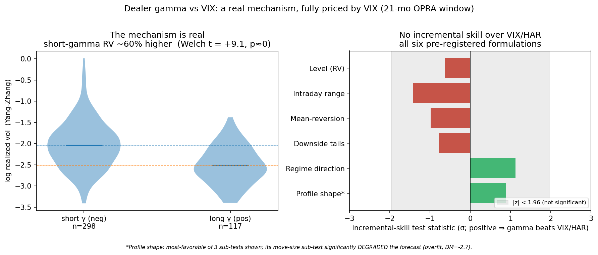
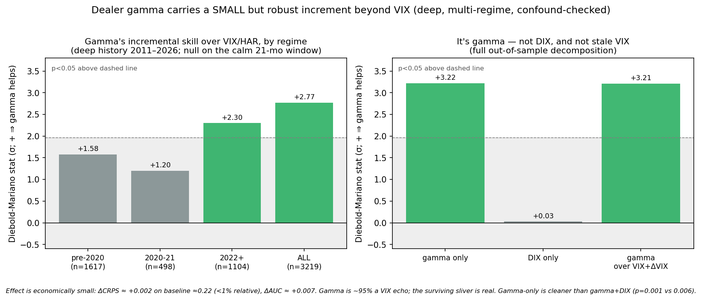

# Does Dealer Gamma Carry Volatility Information Beyond VIX?

**Result.** Dealer gamma tracks realized volatility strongly: short-gamma days carry far higher RV (Welch t ≈ +28 over 15 years). But almost all of that is already in VIX: a variance decomposition puts **97.8%** of gamma's own explanatory power for log-RV inside a VIX/HAR baseline, leaving a 2.2% incremental sliver. On a calm 21-month options window that residual is undetectable, a clean null across six pre-registered formulations. On 15 years spanning real stress regimes, a small, statistically robust, gamma-specific increment survives: gamma-only Diebold-Mariano on CRPS **p = 0.001** (Clark-West, the correct test for this nested comparison, agrees at **p < 0.001**), ΔAUC **p = 0.001**. The increment is genuinely *gamma*, not the DIX flow signal that ships alongside it (adding DIX on top of gamma dilutes rather than helps, p = 0.006 vs 0.001), it survives a richer VIX baseline rather than proxying a stale VIX, and it is economically small. Finding it at all took statistical power, multiple regimes, and a confound check.

Runnable evidence is in `analysis/`. This is the signal investigation behind one of the inputs to the strategy in [`STRATEGY.md`](STRATEGY.md).

---

## 1. The question, and why the obvious framing is wrong

Options dealers hedge their inventory, and the direction of that hedging flips with their gamma position. When dealers are **long gamma** they hedge counter-trend, which suppresses realized volatility and pins price; when they are **short gamma**, below the gamma flip, they hedge trend-following, which amplifies moves. So gamma plausibly modulates the volatility regime. The naive test, *"does gamma beat VIX at forecasting the level of RV,"* is a trap, because VIX is by construction the market's price of forward variance and will absorb most of any volatility signal. The sharp, falsifiable question is the incremental one:

> **Does dealer gamma carry RV-regime information incremental to a VIX/HAR baseline, and if so, how large, and where?**

A null is a fully acceptable answer to that question. As it turns out the answer is "almost none, but not zero on a powered sample," and stating that precisely is the point.

## 2. Data (all free; downloaded and git-ignored; the fetcher ships)

| Source | What | Window |
|---|---|---|
| **SqueezeMetrics** `DIX.csv` | daily dealer **GEX** (and DIX) for the S&P | **2011-05 → 2026-05** (3,791 rows, verified live) |
| **CBOE** `VIX_History.csv` | VIX | 1990 → 2026 |
| **yfinance** | SPY OHLC (Yang-Zhang RV), VIX3M / VIX9D / VVIX | 2010/2011 → 2026 |
| Databento OPRA (owned) | signed net gamma and by-strike profile (the 21-month sub-study) | 2024-08 → 2026-03 |
| FRED | DGS3MO risk-free | daily |

SqueezeMetrics' `gex` is negative on **9.1%** of the deep window (~345 short-gamma days, clustered in 2011/2015/2018/2020/2022), which is enough to study the amplification regime that the calm owned window could not see.

## 3. Method

- **Contamination-fixed target**: RV regime versus a baseline ending at `t−1`, excluding the present value, so the comparison cannot leak the day it is being measured against.
- **Pre-registration** of every mechanism-derived formulation, and strict no-lookahead (predictors ≤ `t−1`, gamma lagged for OCC's T-1 open interest).
- **Out-of-sample expanding walk-forward** (~2y initial train, ~3,200 OOS days).
- **The right test**: a **Diebold-Mariano test on the CRPS differential** of *nested* models (VIX/HAR versus +gamma), with Newey-West HAC and the Harvey small-sample correction, alongside a **Clark-West test** (the textbook correction for DM's conservative bias on nested models); binary targets via OOS log-loss and AUC with a stationary block-bootstrap. DM and the AUC bootstrap are two-sided tests of a one-sided (directional) hypothesis, "gamma helps"; CW is reported one-sided, as is standard for nested-model comparisons.
- **Per-regime reporting**, never pooled across the 0DTE structural break (pre-2020 / 2020-21 / 2022+).
- **Confound decomposition** separating gamma from DIX and from stale VIX, with multiplicity in view.

Implementation in pure NumPy/SciPy/scikit-learn: `analysis/phase1_deep_history.py`, `analysis/phase1_robustness.py`, plus the 21-month sub-study `analysis/phase0_gonogo.py`, `phase05_reframe.py`, `phase05b_profile.py`.

## 4. The mechanism is real and stable across regimes

Mean log realized vol by dealer-gamma sign, deep history:

| Era | short-gamma logRV | long-gamma logRV | Welch t |
|---|---|---|---|
| 2011–2026 (all) | **−1.41** (n=338) | −2.29 (n=3,385) | **+27.6** |
| pre-2020 | −1.48 | −2.38 | +20.4 |
| 2020–21 | −0.99 | −2.12 | +9.9 |
| 2022+ | −1.49 | −2.18 | +16.9 |

Short-gamma days carry dramatically higher RV in every regime (p ≈ 0 throughout). Gamma is genuinely informative. The whole question is how much of that survives controlling for VIX.

## 5. Results

### 5a. The 21-month owned window: a clean null

On 2024-08 → 2026-03 (415 days, one calm regime), gamma added nothing beyond VIX/HAR across six pre-registered formulations: level, intraday range (pinning), mean-reversion, downside tails, regime-direction, and by-strike profile shape (the profile features actually *overfit* and degraded the forecast). Underpowered and confined to one regime, this window cannot see a small effect. Details in `analysis/phase0*.py`.



### 5b. The deep history (2011–2026): a small but robust increment

Incremental skill of gamma over a full VIX/HAR baseline, out-of-sample:

| Block | n (OOS) | dCRPS | DM p (2-sided) | CW p (1-sided) | ΔAUC | AUC p | Verdict |
|---|---|---|---|---|---|---|---|
| **All** | 3,219 | +0.0020 | **0.006** | **<0.001** | +0.007 | **0.003** | gamma helps |
| pre-2020 | 1,617 | +0.0016 | 0.115 | **<0.001** | +0.005 | 0.192 | null (positive) |
| 2020–21 | 498 | +0.0022 | 0.229 | **0.004** | +0.009 | 0.108 | null (positive) |
| 2022+ | 1,104 | +0.0024 | **0.021** | **<0.001** | +0.007 | 0.067 | gamma helps |

DM is the conservative test here: it does not credit the extra gamma parameters unless they clear a high bar, so a DM null (pre-2020, 2020-21) does not mean CW agrees. CW is one-sided by construction (it tests whether the larger model wins) and comes in stronger everywhere, exactly the pattern the DM-vs-CW literature predicts for a nested comparison.

The **confound decomposition** is the critical check, because SqueezeMetrics ships gamma *and* DIX (a flow signal, not gamma):

| Added to VIX/HAR | DM p (2-sided) | CW p (1-sided) | AUC p |
|---|---|---|---|
| **gamma only** (gex pct + neg-flag) | **0.001** | **<0.001** | **0.001** |
| DIX only | 0.97 (null) | **0.007** (significant) | 0.78 |
| gamma, over VIX **+ ΔVIX** baseline | **0.001** | **<0.001** | 0.001 |

DIX-only is the one case where DM and CW disagree outright: DM calls it a clean null, CW calls it significant. This project does not resolve that disagreement in DIX's favor; both numbers are reported and DIX-only stays an open question rather than a settled null. It does not change the headline conclusion, which rests on DM (the primary test throughout this project) applied to the combination: gamma-only beats gamma+DIX on DM (p=0.001 vs 0.006), so adding DIX on top of gamma dilutes rather than helps. CW does not show the same ordering here (its statistic is marginally larger for gamma+DIX than gamma-only), which is expected: CW is known to reward added parameters somewhat regardless of true incremental value, which is exactly why it is used only to check that DM's conservatism is not hiding real gamma signal, not as the test for judging whether an addition helps. On the test built for that judgment, DIX adds nothing once gamma is already in the model.

It is also small: dCRPS ≈ +0.002 on a baseline CRPS ≈ 0.22 (under 1% relative), ΔAUC ≈ +0.007. A variance decomposition (`analysis/phase1_robustness.py`, in-sample R² of log-RV on gamma alone vs. on VIX/HAR vs. on both) puts **97.8%** of gamma's own explanatory power inside VIX/HAR (R² 0.307 → incremental R² 0.0067 once VIX/HAR is already in the model): gamma is almost entirely a VIX echo, and the last 2.2% is real.



## 6. Conclusion

Dealer gamma carries a small, statistically robust increment to next-day RV forecasting beyond VIX. It is detectable only on a powered, multi-regime sample, it is gamma-specific rather than a DIX or stale-VIX artifact, and it was invisible on a calm 21-month window, which is a reminder that "no signal" on a short single-regime sample is a statement about power, not about the world.

Whether a sub-1%-CRPS, 0.7-AUC-point edge is *tradeable* after costs is a separate question, and the answer in [`STRATEGY.md`](STRATEGY.md) is no: dealer gamma adds nothing to a working short-vol carry once the VIX term structure is already in the model (every gamma overlay tested reduces risk-adjusted return). That is the trading-side corroboration of this document: gamma's increment is real but so small it rounds to zero against VIX. The result rides on SqueezeMetrics' proprietary gamma model, so an independent reconstruction, and the intraday/0DTE timescale where the mechanism is strongest, are the natural next tests.

A first growth probe (`analysis/phase2_learned_flip.py`) finds the daily gamma→RV relationship is a smooth, near-linear gradient in gamma percentile rather than a sharp threshold at the flip. A regime-switching learned-flip model does not beat the plain linear gamma term (DM p=0.35), so on daily data the edge is the small linear sliver and a nonlinear model would add complexity without payoff. Any larger, tradeable structure would have to live at the intraday scale, which makes intraday the highest-value next test.

## 7. Reproduce

```bash
# env with pandas/numpy/scipy/scikit-learn + pyarrow; fetchers download free data
python analysis/phase1_deep_history.py   # deep-history test, per-regime
python analysis/phase1_robustness.py     # gamma-vs-DIX + richer-VIX decomposition
python analysis/phase0_gonogo.py         # 21-month sub-study (level)
python analysis/phase05_reframe.py       # 21-month sub-study (path/dynamics/tails/regime)
python analysis/phase05b_profile.py      # 21-month sub-study (profile shape)
```
