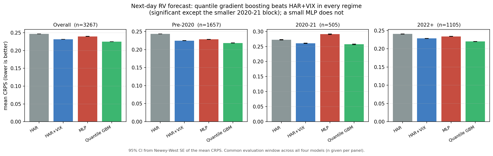

# Can Gradient Boosting Beat HAR at Forecasting Next-Day Volatility?

**Result.** Yes, on this data: a walk-forward quantile gradient boosting model beats a
VIX-augmented HAR baseline on next-day realized-volatility CRPS by **2.9%** overall
(Diebold-Mariano p = 6.7 × 10⁻⁵), and beats plain HAR by **9.0%**. The improvement holds in
every regime block and is statistically significant in two of three (pre-2020 and 2022+;
the smaller 2020-21 block, n = 505, is directionally the same but not significant). A small
MLP on the same features does **not** beat the linear baseline: it scores **3.5% worse**
than HAR+VIX overall (p = 2.0 × 10⁻⁴), and far worse in the 2020-21 block specifically
(10.4% worse). This is the repo's one flagship ML win, reported next to its one plainly
stated ML loss on the same benchmark.

Runnable evidence is in `analysis/forecast_bench.py`. This is a standalone forecasting
benchmark; it does not feed the strategy in [`STRATEGY.md`](STRATEGY.md) or the signal
study in [`FINDINGS.md`](FINDINGS.md).

---

## 1. The question

Every ML component elsewhere in this repo is a null: a walk-forward Ridge sizing layer, a
logistic direction sleeve, and a dealer-gamma overlay all lose to a parameter-free rule
(see STRATEGY.md §4d and FINDINGS.md). That is a real, reported result, not a repo that
just hasn't tried ML hard enough. But it leaves one open question: is that because ML has
nothing to add to this data, or because none of those specific applications gave it a fair
shot? This benchmark gives ML the fair shot: a head-to-head, walk-forward, probabilistically
scored forecasting contest against the strongest classical baseline (HAR augmented with the
full VIX family), on the single task realized-volatility forecasting is built for.

> **Does a gradient-boosted or small neural model beat a VIX-augmented HAR baseline at
> forecasting next-day realized volatility, out of sample?**

A loss would have been reported with the same prominence as a win (see §5).

## 2. Data and target

Same deep-history panel as STRATEGY.md/FINDINGS.md (`load_panel` in
`analysis/strategy_two_sleeve.py`; free, fetched via `make deep`, window 2011 → 2026-05).
**Target**: next-day log Yang-Zhang realized volatility (the `rv` column used everywhere
else in the repo). Framed per-row: the predictors at row `t` are already lagged to `t-1`
information (`build_signals`'s existing `har_d/har_w/har_m/vix_l/t_30_90` columns, plus one
added `vvix_l`, all `shift(1)`'d there), and the target is `t`'s realized log-RV: each row is
a genuine next-day forecast made on the prior close.

## 3. Method

- **Baselines** (must be strong, or a win is fake): **HAR** (Corsi 2009: daily/weekly/monthly
  lagged log-RV) and **HAR+VIX** (adds VIX level, the VIX/VIX3M term-structure ratio, and
  VVIX), the baseline the challengers must beat.
- **Challengers**: **quantile gradient boosting** (`sklearn.GradientBoostingRegressor`,
  one model per quantile on an 11-point grid from 0.05 to 0.95, 60 trees, max depth 2) and a
  **small MLP** (one hidden layer, 8 units, 65 parameters total: a static feedforward net on
  the same tabular features, not a recurrent/temporal architecture; no torch/tensorflow
  dependency exists elsewhere in this repo, and adding one for a single small net was not
  worth the new dependency). No other model families, per the project's own v1 lesson: at
  this sample size, spend the complexity budget on inference, not a model zoo.
- **Protocol**, identical to `ml_size_positions`/`timing_positions` elsewhere in the repo:
  expanding walk-forward, ~2y (504-day) initial train, monthly (21-day) refit, train-only
  standardization, 5-day embargo between train end and prediction.
- **Scoring**: CRPS. The point-forecast models (HAR, HAR+VIX, MLP) use Gaussian CRPS with a
  **causal rolling-variance sigma** (a 63-day rolling std of *already-realized* residuals,
  never today's), so the score adapts to volatility clustering instead of assuming constant
  residual variance for a whole 21-day refit block. Quantile GBM's CRPS is the standard
  finite-quantile-grid approximation (2 × mean pinball loss across the grid; Gneiting &
  Raftery 2007); it truncates the tails beyond 0.05/0.95, so it understates true CRPS
  somewhat for both challengers equally, which is fine for a head-to-head ranking but is not
  a calibrated absolute CRPS.
- **Inference**: Diebold-Mariano (Newey-West HAC, Harvey small-sample correction) and
  Clark-West, the same hand-rolled functions FINDINGS.md uses (`phase1_deep_history.py`;
  statsmodels is absent from the `trading` env). HAR vs HAR+VIX is a **nested** comparison
  (VIX augments HAR) and gets both CW (point-forecast squared-error, the test's original
  use) and DM (on the CRPS differential). HAR+VIX vs each challenger is **non-nested**
  (different model families) and gets DM only, on CRPS.
- **Regimes**: pre-2020 / 2020-21 / 2022+, the repo's standard split, never pooled.
- **Evaluation window**: every model must have a finite CRPS that day, so every comparison
  runs on the identical 3,267-day sample (2013-06-04 → 2026-05-29).
- **Leakage test**: every model (HAR/HAR+VIX share one function, MLP, quantile GBM) has a
  dedicated future-perturbation test in `tests/test_forecast_bench.py`, run and green before
  these results were read.

## 4. Results

Mean CRPS by model and regime (lower is better; common 3,267-day evaluation window, 95% CI
from Newey-West SE):

| Model | Overall | Pre-2020 | 2020-21 | 2022+ |
|---|---|---|---|---|
| HAR | 0.2469 | 0.2434 | 0.2721 | 0.2407 |
| HAR+VIX | 0.2315 | 0.2247 | 0.2606 | 0.2284 |
| MLP (65 params) | 0.2398 | 0.2281 | 0.2908 | 0.2340 |
| **Quantile GBM** | **0.2248** | **0.2181** | **0.2573** | **0.2200** |



Pairwise tests (dCRPS = row-model CRPS minus comparison-model CRPS; positive favors the
comparison model):

| Comparison | Block | dCRPS | DM p | CW p |
|---|---|---|---|---|
| HAR vs **HAR+VIX** (nested) | Overall | +0.0154 | 1.2 × 10⁻¹⁰ | < 10⁻¹⁵ |
| | Pre-2020 | +0.0187 | 1.7 × 10⁻¹³ | < 10⁻¹⁵ |
| | 2020-21 | +0.0116 | 0.27 (null) | 6.2 × 10⁻⁵ |
| | 2022+ | +0.0123 | 1.3 × 10⁻⁵ | < 10⁻¹⁵ |
| HAR+VIX vs **Quantile GBM** | Overall | +0.0067 | 6.7 × 10⁻⁵ | n/a |
| | Pre-2020 | +0.0066 | 5.3 × 10⁻⁵ | n/a |
| | 2020-21 | +0.0033 | 0.72 (null) | n/a |
| | 2022+ | +0.0084 | 1.3 × 10⁻⁹ | n/a |
| HAR+VIX vs **MLP** | Overall | −0.0083 | 2.0 × 10⁻⁴ (MLP worse) | n/a |
| | Pre-2020 | −0.0034 | 0.11 (null) | n/a |
| | 2020-21 | −0.0302 | 6.1 × 10⁻⁴ (MLP worse) | n/a |
| | 2022+ | −0.0056 | 0.064 (null) | n/a |

VIX materially helps HAR (as established, unsurprising, and a useful sanity check on the
whole pipeline): CW rejects the null everywhere, DM agrees except the smaller 2020-21 block,
the same DM-conservative-on-nested-models pattern FINDINGS.md documents for gamma. The
**flagship result** is quantile GBM beating the VIX-augmented baseline itself, DM-significant
overall and in two of three regimes; 2020-21 (n = 505, the shortest block) is directionally
the same (+0.0033) but underpowered. The MLP does not clear the bar it was given the same
fair shot at: it is worse than the linear baseline overall and dramatically worse in 2020-21,
where a small, monthly-refit net evidently struggled with the regime's volatility-of-volatility.
A plausible read is that a 65-parameter feedforward net has neither the inductive bias
(HAR's own lagged structure) nor the flexibility (GBM's tree splits) to add value at this
daily sample size (~3,700 rows): a useful, specific negative result rather than "ML doesn't
work here."

**Multiplicity**: 3 model-comparison pairs × 4 blocks (overall + 3 regimes) = 12 tests total.
No formal correction (e.g. Bonferroni) is applied; p-values are reported raw so a reader can
judge for themselves. The two headline claims (GBM beats HAR+VIX overall; MLP loses to
HAR+VIX overall) both clear p < 0.001 individually, well inside any reasonable correction for
12 tests.

## 5. Outcome, reported as designed

This benchmark was designed before results were read to report whichever of "ML wins" or
"ML nulls" was actually true, with the same prominence either way. The actual outcome is a
split verdict: GBM wins, MLP doesn't, and that is what is reported. No feature or horizon
changes were made after seeing these numbers.

## 6. Reproduce

```bash
make deep                              # free data, if not already fetched
python analysis/forecast_bench.py      # -> analysis/forecast_bench_results.json
python analysis/make_figure_forecast.py
```
