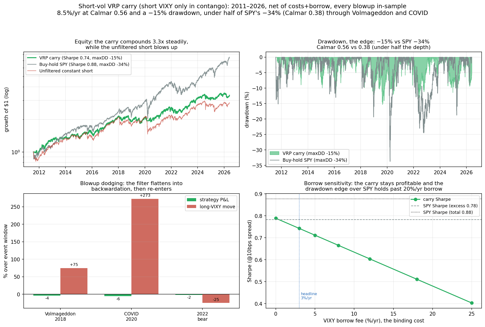

# Dealer Gamma vs Realized Volatility — a powered, honest investigation

[](https://github.com/PrakritD/spy-vol-project/actions/workflows/ci.yml)

> **Two honest quant deliverables on $0 of free data** — a **[dealer-gamma signal study](FINDINGS.md)** and a **[risk-managed short-vol strategy](STRATEGY.md)** — built with the discipline that makes a small-or-negative result trustworthy, and **stress-tested by a self-run multi-agent adversarial audit that caught and corrected my own over-claims** (a fake "+0.84 Sharpe" in v1; a clone-inflated Deflated Sharpe in a v2 draft). Calibrated truth over a manufactured headline — in both directions.

**Is dealer gamma exposure a VIX echo?** Mostly — but not entirely.

> Dealer gamma tracks realized vol enormously (short-gamma days carry far higher RV, t ≈ +28 over 15 years) yet is **~95% redundant with VIX**. On a calm 21-month window the residual is **undetectable** (a clean null across six pre-registered formulations). On **15 years across real stress regimes it is a small but statistically robust increment** beyond a full VIX/HAR baseline — **gamma-only Diebold-Mariano on CRPS p = 0.001, ΔAUC p = 0.001** — and that increment is genuinely *gamma* (not the Dark-Index flow signal) and survives a richer VIX baseline. The edge is **real and economically small**. Finding it required statistical power, multiple regimes, and a confound check.

**→ Full write-up: [`FINDINGS.md`](FINDINGS.md).**


## Two deliverables

1. **[`FINDINGS.md`](FINDINGS.md) — the signal investigation.** Is dealer gamma a VIX echo? (Mostly, with a small real increment; see above.)
2. **[`STRATEGY.md`](STRATEGY.md) — the trading strategy.** A risk-managed short-volatility **variance-risk-premium carry** (short VIXY only when the VIX term structure is in contango). Over 2011–2026 including Volmageddon and COVID, net of costs and borrow: **Sharpe 0.74, Calmar 0.56, maxDD −15%**. The honest verdict — established by an internal adversarial audit that dismantled a first draft's over-claims — is that it **does *not* beat buy-and-hold SPY on Sharpe (0.78–0.88); its durable edge is drawdown control (Calmar 0.56 vs 0.38, −15% vs −34%)**, and gamma/DIX/vol-targeting add nothing. A capital-efficient premium, not uncorrelated alpha.



## What this is

A study of whether options-dealer **gamma exposure** carries realized-volatility-regime information *incremental to* VIX — asked as a sharp, falsifiable question and answered with the method that makes a negative-or-small result trustworthy:

- **Contamination-fixed target**, pre-registration, strict no-lookahead.
- Out-of-sample **expanding walk-forward**; the **nested Diebold-Mariano test on CRPS** (not raw correlation); block-bootstrap for classification.
- **Per-regime reporting** (never pooled across the 0DTE structural break); confound decomposition (gamma vs DIX vs stale-VIX); multiple-testing control.
- All on **free data**: SqueezeMetrics GEX/DIX (2011→), CBOE VIX (1990→), yfinance SPY/VIX-family, FRED.

## Honest provenance (v1 → v2)

This repo began as a "vol-regime classifier → VXX long-flat strategy" (v1). An audit found that v1 was **fooling itself**: its "+0.84 Sharpe" was a single lucky day, its GEX feature was a VIX echo, and its headline numbers didn't match the shipped config. That story — and why it's instructive — is in [`docs/v1-retrospective.md`](docs/v1-retrospective.md). The reframe to the falsifiable gamma question is in [`docs/specs/2026-05-29-gamma-regime-vol-design.md`](docs/specs/2026-05-29-gamma-regime-vol-design.md). The v1 pipeline is **quarantined under [`legacy/`](legacy/)** (not deleted — the reason it was abandoned is part of the story); its conclusions are superseded by `FINDINGS.md` / `STRATEGY.md`. The same self-correction recurred *inside* v2: a first draft of the strategy over-claimed (a clone-inflated Deflated Sharpe, a "beats SPY" framing), and a self-run multi-agent adversarial audit caught and fixed it — the published numbers are what survived.

## Repository layout

| Path | What |
|---|---|
| `analysis/` | the v2 deliverables — `strategy_two_sleeve.py` (STRATEGY), `phase1_*` (FINDINGS deep-history), `make_figure_*` |
| `FINDINGS.md` / `STRATEGY.md` | the two write-ups |
| `notebooks/strategy_walkthrough.ipynb` | a rendered, re-runnable narrative tying both together |
| `docs/` | v1 retrospective, design spec, and the cited extension roadmap |
| `features/`, `ingest/`, `configs/` | feature-eng + Databento ingest (retained for the 21-month OPRA sub-study) |
| `tests/` | data-free test suite (the no-lookahead gate runs on synthetic panels) — green in CI |
| `legacy/` | the quarantined v1 classifier→VXX pipeline ([`legacy/README.md`](legacy/README.md)) |

## Reproduce

```bash
make install        # editable install + dev tools (env: pandas/numpy/scipy/scikit-learn/pyarrow/matplotlib)
make test           # data-free test suite (no-lookahead gate on synthetic panels) — also runs in CI
make findings       # deep-history gamma study + robustness decomposition
make strategy       # VRP-carry backtest + robustness -> analysis/strategy_results.json
make figures        # regenerate the committed figures
make all            # everything above + execute the walkthrough notebook
```

The notebook **[`notebooks/strategy_walkthrough.ipynb`](notebooks/strategy_walkthrough.ipynb)** renders on GitHub and re-runs from committed, ToS-clean artifacts — no licensed data required.

Data is **fetched, not committed** — SqueezeMetrics' terms bar redistribution, and OPRA/price history is large. The fetchers download it into the (git-ignored) `data/` tree; the `make findings`/`make strategy` targets need that data present, but `make test` and the notebook do not.

## What this demonstrates

Calibrated judgment in both directions: refusing a fake +0.84 edge, *and* refusing to dismiss a small real one — establishing the latter only with a powered, multi-regime, confound-checked test (and catching my own bug along the way). Quant rigor on a real question, not a manufactured headline.

## License

MIT.
