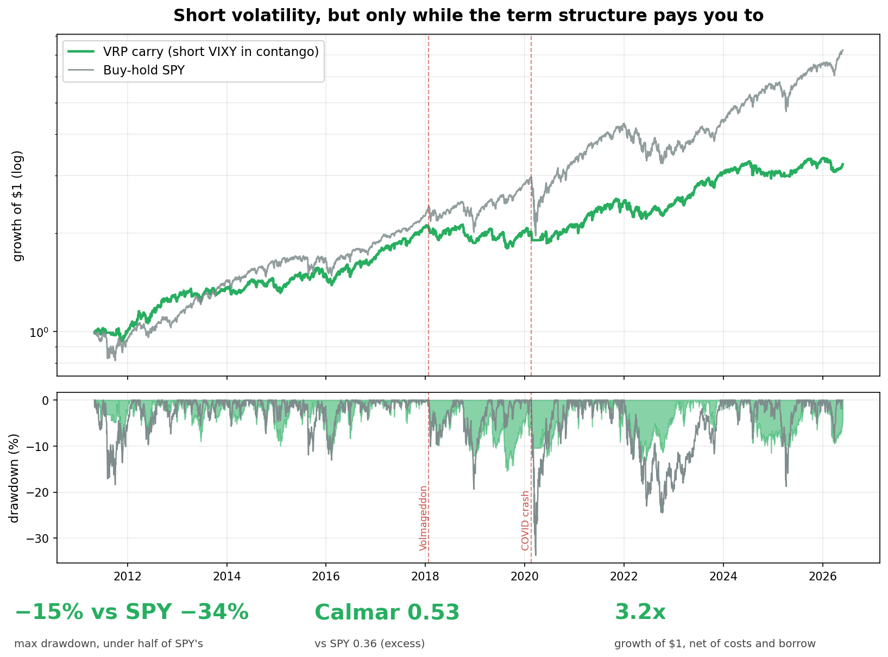

# Short-Volatility Carry on SPY

[](https://github.com/PrakritD/spy-vol-project/actions/workflows/ci.yml)

A self-directed project on the variance risk premium. It contains one strategy, tested against the objections I could think of, and a record of the signals I tried that did not improve it.

The trade is not original. Shorting VIX exposure while the futures curve is in contango is documented in Simon & Campasano (2014) and the literature around it. I picked a known trade on purpose, so the work would go into testing it rather than into claiming a discovery. Most of what I learned came from the parts that failed.

## The idea

Options on the S&P 500 are crash insurance, and buyers persistently overpay: the volatility implied by option prices is usually higher than the volatility that arrives. That gap is the variance risk premium. Selling it works like any insurance book, in that premiums arrive daily and claims arrive all at once. A single volatility spike can return years of collected premium in days.

So the problem is not finding the premium, it is surviving it. This strategy sells volatility only while the VIX futures curve slopes upward (one-month VIX below three-month, the calm state), by shorting VIXY, an ETF built to decay in exactly that state. When the curve inverts, which is the usual pre-spike signature, it steps aside. The curve tends to invert before the spike rather than during it, so the book is often already flat when the damage lands.

The rule is one line, and no parameter in it was fit on this sample: **short VIXY while `VIX < VIX3M`, flat otherwise.**

## What it does, 2011 to 2026, net of costs and borrow

8.1%/yr excess of cash, with a maximum drawdown of −15% against SPY's −34%. The drawdown difference is the part that holds up: shallower than SPY's in 96% of paired bootstrap resamples, and still −20% against −34% under next-open fills instead of the headline close fills.

**Sharpe is 0.72, which loses to buy-and-hold SPY at 0.76.** The Calmar advantage (0.53 against 0.36) has a bootstrap confidence interval spanning zero, so drawdown depth is the claim I can support and risk-adjusted return is not. Alpha against SPY is +3.0%/yr at t = 1.22, which is not significant, and the write-up says so.

Full attribution, cost and borrow stress, per-regime robustness, and a VaR/ES risk chapter are in **[`STRATEGY.md`](STRATEGY.md)**. The construction ladder in §4 isolates where the risk-adjusted return comes from: the term-structure filter roughly doubles Calmar and halves drawdown by being absent during the regime that produces the losses.



## What I tried that did not work

None of these improved the strategy. They are kept because deleting them would misrepresent how much searching went into the result, and because a few of them are more interesting than the strategy is.

| What I tried | Where | What happened |
|---|---|---|
| Dealer gamma as a volatility signal | [`FINDINGS.md`](FINDINGS.md) | 97.8% of its explanatory power is already in VIX. A small gamma-specific increment does survive on 15 years (DM on CRPS, p = 0.001), but it is too small to trade. |
| DIX, a dark-pool flow measure | [`FINDINGS.md`](FINDINGS.md) §5b | Adds nothing once gamma is in the model. DM and Clark-West disagree on it, and I report both rather than picking the flattering one. |
| 25-delta put-call skew | [`FINDINGS.md`](FINDINGS.md) §5c | Significantly *worse* than the baseline, in both formulations tested. |
| Crowding in the short-vol trade | [`CROWDING.md`](CROWDING.md) | Modelled as a congestion game and pre-registered before testing. Two of four predictions falsified, two not robust across measures. |
| Walk-forward Ridge position sizing | [`STRATEGY.md`](STRATEGY.md) §4c | Loses to the parameter-free rule. |
| A logistic direction sleeve | [`STRATEGY.md`](STRATEGY.md) §4d | Out-of-sample AUC 0.51, a coin flip. |
| Fitted-Q reinforcement learning for sizing | unpublished pilot | Never recovered the contango threshold; sat at zero exposure across the whole feature range. |
| The same rule on VXN, RVX, OVX, GVZ | unpublished pilot | No free term-structure signal exists for any of them, and no liquid short vehicle. |

The crowding study is the one I would point at. It starts from a mechanism rather than a candidate predictor, the predictions were [pre-registered and pushed](CROWDING-PREREG.md) before the test code existed, and the single pre-registered pass was then undone by a placebo I ran on myself: the volume denominator alone, with no crowding data in it, reproduced the effect more strongly.

`CROWDING.md` §6 also counts the search across the whole project. Every study here reports its own deflated Sharpe or p-value, and none of them accounts for the search conducted across studies on overlapping data.

## The one thing that did work, outside the strategy

Every ML component inside the strategy is a null, so **[`FORECASTING.md`](FORECASTING.md)** asks the question directly on ground where ML has a fair shot: can it beat a strong classical baseline at forecasting next-day realized volatility? A walk-forward quantile gradient boosting model beats a VIX-augmented HAR baseline on CRPS by 2.9% (p = 1.2 × 10⁻⁵). A small MLP on the same features does not (4.2% worse, p = 5.5 × 10⁻⁵). This is a forecasting benchmark, not a trading signal, and it does not feed the strategy.


## How it is built

The tests matter more than the results here, because most of the results are negative and a negative result is only worth reading if the machinery is trustworthy.

- **No lookahead, enforced rather than asserted.** A CI property test perturbs raw inputs strictly in the future and requires earlier positions and P&L to be byte-identical. When I added the crowding feature, the first version of its gate passed even with a deliberate lookahead injected, so I rewrote it until the injected leak turned it red.
- **Walk-forward wherever a model is fit**: expanding windows, refit embargoes, train-only scaling.
- **Selection-aware significance**: deflated Sharpe over every variant tried (0.64–0.79), reported as a range and as a curve in the number of trials, not a single p-value on the winner.
- **Per-regime reporting**, never pooled across structural breaks such as the 0DTE shift or the February 2018 ETP deleverage.
- **Free data throughout**: SqueezeMetrics GEX/DIX, CBOE VIX, yfinance, FRED, FINRA short interest. The one paid input is a $95 Databento OPRA pull, used for the 21-month options sub-study.

Design notes, data flow and the reasoning behind the invariants are in [`docs/ARCHITECTURE.md`](docs/ARCHITECTURE.md).

## Repository layout

| Path | What |
|---|---|
| `analysis/` | `strategy_two_sleeve.py` (the strategy), `phase1_*` (deep-history gamma study), `forecast_bench.py` (ML benchmark), `crowding_model.py` + `crowding_test.py` (crowding), plus standalone robustness studies and figure scripts |
| `STRATEGY.md` | the strategy write-up |
| `FINDINGS.md` / `FORECASTING.md` / `CROWDING.md` | the three investigations, also a [PDF](report/FINDINGS.pdf) for the first |
| `CROWDING-PREREG.md` | the crowding pre-registration, committed and pushed before its test code existed |
| `notebooks/strategy_walkthrough.ipynb` | a rendered, re-runnable walkthrough of the strategy |
| `features/`, `ingest/`, `configs/` | feature engineering, the free-data fetchers, and the two-stage Databento OPRA pull |
| `tests/` | data-free test suite; the no-lookahead gates run on synthetic panels, green in CI |
| `docs/ARCHITECTURE.md` | design notes: data flow, invariants, and the reasoning behind them |

## Reproduce

```bash
make install        # editable install + dev tools (pandas/numpy/scipy/scikit-learn/pyarrow/matplotlib)
make test           # data-free test suite (no-lookahead gates on synthetic panels); also runs in CI
make deep           # fetch the free inputs (yfinance, CBOE, FRED, SqueezeMetrics) + validate VIXY splits
make short-interest # fetch free FINRA short interest + ETP splits -> data/raw/short_interest/
make strategy       # VRP-carry backtest + robustness -> analysis/strategy_results.json
make findings       # deep-history gamma study + robustness decomposition
make forecast       # walk-forward ML forecasting benchmark -> analysis/forecast_bench_results.json
make crowding       # crowding model + the pre-registered P1-P4 tests -> analysis/crowding_*_results.json
make figures        # regenerate the committed figures
make findings-pdf   # render FINDINGS.md -> report/FINDINGS.pdf (pandoc + LaTeX)
make log            # append today's close to the live paper-trade log (idempotent)
make all            # everything above + execute the walkthrough notebook
```

The notebook [`notebooks/strategy_walkthrough.ipynb`](notebooks/strategy_walkthrough.ipynb) renders on GitHub and re-runs from committed, ToS-clean artifacts, so it needs no licensed data. The analysis targets need the free data present first: `make deep` fetches it into the git-ignored `data/` tree, records every file's row count and sha256 in a manifest, and cross-validates VIXY's reverse-split-adjusted series against VXX. The window end is pinned to the vintage behind the committed results, so a fresh clone reproduces the headline numbers. Raw data is fetched rather than committed, because SqueezeMetrics' terms bar redistribution and the price history is large. [`requirements-lock.txt`](requirements-lock.txt) pins the environment that produced the committed numbers. A live signal log has been recorded since 2026-07-13 in [`analysis/paper_log.csv`](analysis/paper_log.csv).

## License

MIT.
