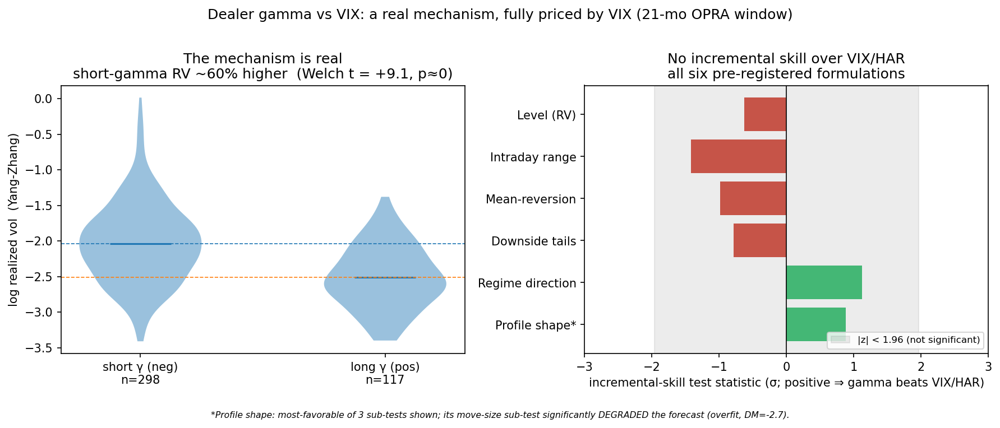
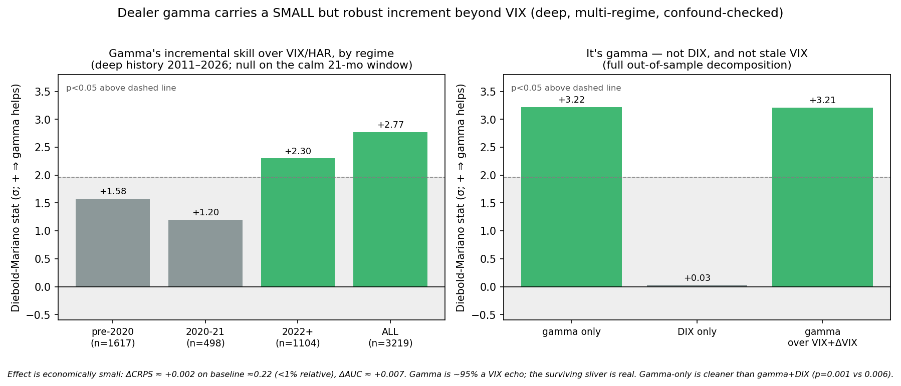
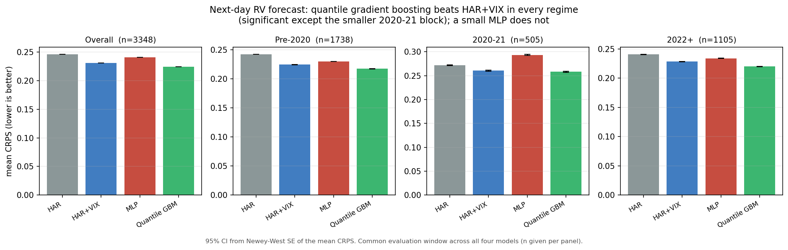

# Does Dealer Gamma Carry Volatility Information Beyond VIX?

Dealer gamma tracks realized volatility hard. Short-gamma days carry a Welch t of +28 over fifteen years. Almost none of that is usable, because a variance decomposition puts **97.8%** of gamma's explanatory power for log realized volatility inside a VIX/HAR baseline. The remaining 2.2% is real and survives on deep history (Diebold-Mariano on CRPS, p = 0.001; Clark-West agrees at p < 0.001), and it is too small to trade.

Section 6 asks the follow-on question: is that a fact about this signal, or about machine learning on this data? Given a clean forecasting task and a fair fight, gradient boosting does beat the classical baseline. So the null is specific to gamma, not general to the method.

Runnable evidence in `analysis/`. The trading-side corroboration is in [`STRATEGY.md`](STRATEGY.md), where every gamma overlay tested reduces risk-adjusted return.

---

## 1. The question, and why the obvious framing is wrong

Options dealers hedge their inventory, and the direction of that hedging flips with their gamma position. Long gamma, they hedge counter-trend, suppressing realized volatility and pinning price. Short gamma, below the gamma flip, they hedge trend-following and amplify moves. So gamma plausibly modulates the volatility regime.

The naive test, *does gamma beat VIX at forecasting the level of RV*, is a trap. VIX is by construction the market's price of forward variance and will absorb most of any volatility signal. The sharp question is the incremental one:

> **Does dealer gamma carry RV-regime information incremental to a VIX/HAR baseline, and if so, how large, and where?**

A null is an acceptable answer. The answer here is "almost none, but not zero on a powered sample," and the work is in pinning down which.

## 2. Data

| Source | What | Window |
|---|---|---|
| **SqueezeMetrics** `DIX.csv` | daily dealer **GEX** and DIX for the S&P | **2011-05 → 2026-05** (3,791 rows) |
| **CBOE** `VIX_History.csv` | VIX | 1990 → 2026 |
| **yfinance** | SPY OHLC (Yang-Zhang RV), VIX3M / VIX9D / VVIX | 2010/2011 → 2026 |
| Databento OPRA (owned) | signed net gamma and by-strike profile, the 21-month sub-study | 2024-08 → 2026-03 |
| FRED | DGS3MO risk-free | daily |

All free except the OPRA pull. Downloaded, git-ignored, and the fetcher ships. SqueezeMetrics' `gex` is negative on **9.1%** of the deep window, roughly 345 short-gamma days clustered in 2011, 2015, 2018, 2020 and 2022, which is enough to study the amplification regime the calm owned window could not see.

## 3. Method

- **Contamination-fixed target.** RV regime against a baseline ending at `t−1`, excluding the present value, so the comparison cannot leak the day it is measured against.
- **Pre-registration** of every mechanism-derived formulation, and strict no-lookahead: predictors at `t−1` or earlier, gamma lagged for OCC's T-1 open interest.
- **Out-of-sample expanding walk-forward**, roughly 2y initial train, ~3,200 OOS days.
- **Diebold-Mariano on the CRPS differential** of nested models (VIX/HAR against +gamma), with Newey-West HAC and the Harvey small-sample correction, alongside **Clark-West**, the standard correction for DM's conservative bias on nested models. Binary targets via OOS log-loss and AUC with a stationary block bootstrap.
- **Per-regime reporting**, never pooled across the 0DTE structural break: pre-2020 / 2020-21 / 2022+.
- **Confound decomposition** separating gamma from DIX and from a stale VIX.

Implementation in NumPy/SciPy/scikit-learn: `analysis/phase1_deep_history.py`, `analysis/phase1_robustness.py`, plus the 21-month sub-study in `analysis/phase0_gonogo.py`, `phase05_reframe.py`, `phase05b_profile.py`.

The predictive density scored is Gaussian with sigma held at the train-window residual std. Daily RV residuals are fat-tailed, so absolute CRPS levels are not calibrated forecast quality. Both models share the identical misspecified density and the DM/CW tests difference it out, so the comparison holds.

## 4. The mechanism is real and stable across regimes

Mean log realized vol by dealer-gamma sign, deep history:

| Era | short-gamma logRV | long-gamma logRV | Welch t |
|---|---|---|---|
| 2011–2026 (all) | **−1.41** (n=338) | −2.29 (n=3,385) | **+27.6** |
| pre-2020 | −1.48 | −2.38 | +20.4 |
| 2020–21 | −0.99 | −2.12 | +9.9 |
| 2022+ | −1.49 | −2.18 | +16.9 |

Short-gamma days carry markedly higher RV in every regime, p ≈ 0 throughout. Gamma is informative on its own. The question is how much survives controlling for VIX.

## 5. Results

### 5a. The 21-month owned window: a clean null

On 2024-08 → 2026-03 (415 days, one calm regime), gamma added nothing beyond VIX/HAR across six pre-registered formulations: level, intraday range (pinning), mean-reversion, downside tails, regime-direction, and by-strike profile shape. The profile features actively overfit and degraded the forecast. This window is underpowered and confined to one regime, so it cannot see a small effect. Details in `analysis/phase0*.py`.



### 5b. The deep history, 2011–2026: a small but robust increment

Incremental skill of gamma over a full VIX/HAR baseline, out of sample:

| Block | n (OOS) | dCRPS | DM p (2-sided) | CW p (1-sided) | ΔAUC | AUC p | Verdict |
|---|---|---|---|---|---|---|---|
| **All** | 3,219 | +0.0020 | **0.006** | **<0.001** | +0.007 | **0.003** | gamma helps |
| pre-2020 | 1,617 | +0.0016 | 0.115 | **<0.001** | +0.005 | 0.192 | null (positive) |
| 2020–21 | 498 | +0.0022 | 0.229 | **0.004** | +0.009 | 0.108 | null (positive) |
| 2022+ | 1,104 | +0.0024 | **0.021** | **<0.001** | +0.007 | 0.067 | gamma helps |

DM is the conservative test: it does not credit the extra gamma parameters unless they clear a high bar, so a DM null in pre-2020 and 2020-21 does not mean CW agrees. CW is one-sided by construction and comes in stronger everywhere, the pattern the literature predicts for a nested comparison.

The **confound decomposition** is the critical check, because SqueezeMetrics ships gamma *and* DIX, a flow signal rather than a gamma one:

| Added to VIX/HAR | DM p (2-sided) | CW p (1-sided) | AUC p |
|---|---|---|---|
| **gamma only** (gex pct + neg-flag) | **0.001** | **<0.001** | **0.001** |
| DIX only | 0.97 (null) | **0.007** (significant) | 0.78 |
| gamma, over VIX **+ ΔVIX** baseline | **0.001** | **<0.001** | 0.001 |

So the increment is specifically gamma. It is not DIX riding along, and it is not gamma proxying for a stale VIX. Gamma-only beats gamma+DIX on DM (0.001 against 0.006): adding DIX on top of gamma dilutes rather than helps.

DIX-only is the one place DM and CW disagree outright, and I report both rather than the flattering one. CW rewards added parameters somewhat regardless of true incremental value, which is why it is used here to check that DM's conservatism is not hiding real signal, not as the test for whether an addition helps. DIX-only stays an open question.

The increment is small: dCRPS ≈ +0.002 on a baseline CRPS ≈ 0.22, under 1% relative, and ΔAUC ≈ +0.007. A variance decomposition (`analysis/phase1_robustness.py`, in-sample R² of log-RV on gamma alone against VIX/HAR against both) puts **97.8%** of gamma's own explanatory power inside VIX/HAR: R² 0.307 falls to an incremental 0.0067 once VIX/HAR is in the model.



### 5c. Where the effect lives

A learned-flip probe (`analysis/phase2_learned_flip.py`) finds the daily gamma-to-RV relationship is a smooth, near-linear gradient in gamma percentile rather than a sharp threshold at the flip. A regime-switching model does not beat the plain linear gamma term (DM p = 0.35). On daily data the edge is the small linear sliver, and a nonlinear model adds complexity without payoff.

The same 21-month OPRA window also tested 25-delta put-call skew under the identical protocol (`analysis/phase_skew.py`). It failed differently from gamma: both formulations significantly *underperformed* the baseline rather than merely failing to beat it.

## 6. The follow-on: can any ML model beat a classical baseline here?

Every ML component in the strategy is a null. A walk-forward Ridge sizing layer, a logistic direction sleeve, and the gamma overlay above all lose to a parameter-free rule. That leaves a question the gamma study cannot answer on its own: is ML unable to add anything to this data, or were those three applications just badly chosen?

So I gave it a fair shot on the task realized-volatility forecasting is built for.

> **Does a gradient-boosted or small neural model beat a VIX-augmented HAR baseline at forecasting next-day realized volatility, out of sample?**

**Target**: next-day log Yang-Zhang realized volatility, the `rv` column used everywhere in the repo, on the same deep-history panel. Predictors at row `t` are already lagged to `t−1` information, so every row is a genuine next-day forecast made on the prior close.

**Baselines**, which have to be strong or a win is fake: HAR (Corsi 2009, daily/weekly/monthly lagged log-RV) and HAR+VIX, adding VIX level, the VIX/VIX3M ratio, and VVIX.

**Challengers**: quantile gradient boosting (one model per quantile on an 11-point grid, 60 trees, depth 2) and a small MLP (one hidden layer, 8 units, 65 parameters). Two model families only. At this sample size the complexity budget belongs in the inference, not a model zoo.

**Protocol**, identical to the sizing layers elsewhere in the repo: expanding walk-forward, 504-day initial train, 21-day refit, train-only standardization, 5-day embargo. Scored on CRPS, with a causal 63-day rolling-residual sigma for the point-forecast models so the score adapts to volatility clustering. Every model has its own future-perturbation leakage test in `tests/test_forecast_bench.py`, green before these results were read.

Mean CRPS by model and regime, lower is better, common 3,348-day window:

| Model | Overall | Pre-2020 | 2020-21 | 2022+ |
|---|---|---|---|---|
| HAR | 0.2463 | 0.2424 | 0.2722 | 0.2406 |
| HAR+VIX | 0.2312 | 0.2247 | 0.2604 | 0.2282 |
| MLP (65 params) | 0.2409 | 0.2301 | 0.2936 | 0.2338 |
| **Quantile GBM** | **0.2244** | **0.2175** | **0.2582** | **0.2199** |



Pairwise tests. dCRPS is row-model CRPS minus comparison-model CRPS, so positive favours the comparison model:

| Comparison | Block | dCRPS | DM p | CW p |
|---|---|---|---|---|
| HAR vs **HAR+VIX** (nested) | Overall | +0.0151 | 1.2 × 10⁻¹⁰ | < 10⁻¹⁵ |
| | Pre-2020 | +0.0178 | 4.9 × 10⁻¹³ | < 10⁻¹⁵ |
| | 2020-21 | +0.0117 | 0.27 (null) | 5.2 × 10⁻⁵ |
| | 2022+ | +0.0124 | 9.2 × 10⁻⁶ | < 10⁻¹⁵ |
| HAR+VIX vs **Quantile GBM** | Overall | +0.0068 | 1.2 × 10⁻⁵ | n/a |
| | Pre-2020 | +0.0072 | 1.2 × 10⁻⁶ | n/a |
| | 2020-21 | +0.0022 | 0.80 (null) | n/a |
| | 2022+ | +0.0083 | 3.0 × 10⁻¹⁰ | n/a |
| HAR+VIX vs **MLP** | Overall | −0.0097 | 5.5 × 10⁻⁵ (MLP worse) | n/a |
| | Pre-2020 | −0.0055 | 0.021 (MLP worse) | n/a |
| | 2020-21 | −0.0331 | 9.4 × 10⁻⁴ (MLP worse) | n/a |
| | 2022+ | −0.0056 | 0.061 (null) | n/a |

Quantile GBM beats the VIX-augmented baseline by **2.9%** on CRPS overall (p = 1.2 × 10⁻⁵) and by 8.9% against plain HAR, significant in two of three regimes. The 2020-21 block (n = 505, the shortest) is directionally the same but underpowered.

The MLP loses, by 4.2% overall (p = 5.5 × 10⁻⁵) and dramatically in 2020-21. A 65-parameter feedforward net has neither HAR's inductive bias nor GBM's tree splits, and at ~3,700 daily rows that combination has nothing to offer. That is a specific negative result about a specific architecture, not evidence that ML does not work here, which is exactly the distinction the benchmark was built to draw.

Twelve tests in total, three comparison pairs across four blocks, reported raw with no Bonferroni. Both headline claims clear p < 0.001 individually, well inside any reasonable correction. The benchmark was designed to report whichever of "ML wins" or "ML nulls" turned out true with equal prominence; the outcome is a split verdict and no feature or horizon was changed after seeing it.

This is a forecasting benchmark. It does not feed the strategy.

## 7. Conclusion

Dealer gamma carries a small, statistically robust increment to next-day RV forecasting beyond VIX. It is detectable only on a powered, multi-regime sample, it is gamma-specific rather than a DIX or stale-VIX artifact, and it was invisible on a calm 21-month window. "No signal" on a short single-regime sample is a statement about power, not about the world.

Whether a sub-1%-CRPS, 0.7-AUC-point edge is tradeable is a separate question, and [`STRATEGY.md`](STRATEGY.md) answers no: every gamma overlay tested reduces risk-adjusted return once the VIX term structure is in the model.

Two reasons I think the increment is as small as it is. VIX is close to a sufficient statistic here, because the dealers hedging the inventory are the ones pricing the options, so positioning is in the price before it is in the flow data. And the horizon is probably wrong: gamma hedging is an intraday phenomenon, tested here against next-day RV because daily is what free data gives. The learned-flip probe points the same way, finding no daily nonlinearity worth modelling. Intraday is the highest-value next test, and an independent reconstruction of gamma would remove the dependence on SqueezeMetrics' proprietary model.

A separate study asked whether crowding in the short-vol trade explains the strategy's drawdown edge. Four predictions, pre-registered and pushed before the test code existed; two falsified, two specification-dependent, and a placebo showed the volume denominator alone reproduced the effect with no crowding data in it. Null, written up in [`docs/CROWDING.md`](docs/CROWDING.md).

Every study here reports its own deflated Sharpe or p-value, and none accounts for search conducted across studies on overlapping data. [`docs/CROWDING.md`](docs/CROWDING.md) §6 states that project-level caveat in full.

## 8. Reproduce

```bash
# env with pandas/numpy/scipy/scikit-learn + pyarrow; fetchers download free data
python analysis/phase1_deep_history.py   # deep-history test, per-regime
python analysis/phase1_robustness.py     # gamma-vs-DIX + richer-VIX decomposition
python analysis/phase0_gonogo.py         # 21-month sub-study (level)
python analysis/phase05_reframe.py       # 21-month sub-study (path/dynamics/tails/regime)
python analysis/phase05b_profile.py      # 21-month sub-study (profile shape)
python -m features.opra_panel            # raw OPRA DBN -> options_panel.parquet
python -m features.assemble configs/features.yaml   # -> features_panel.parquet
python analysis/phase_skew.py            # 21-month sub-study (put-call skew)
python analysis/forecast_bench.py        # ML benchmark -> forecast_bench_results.json
python analysis/make_figure_forecast.py
python analysis/make_figure_iv_surface.py
```

## 9. References

- Bollerslev, T., G. Tauchen, and H. Zhou (2009). *Expected Stock Returns and Variance Risk Premia.* Review of Financial Studies 22(11), 4463–4492.
- Clark, T. and K. West (2007). *Approximately Normal Tests for Equal Predictive Accuracy in Nested Models.* Journal of Econometrics 138(1), 291–311.
- Corsi, F. (2009). *A Simple Approximate Long-Memory Model of Realized Volatility.* Journal of Financial Econometrics 7(2), 174–196.
- Diebold, F. and R. Mariano (1995). *Comparing Predictive Accuracy.* Journal of Business and Economic Statistics 13(3), 253–263.
- Gneiting, T. and A. Raftery (2007). *Strictly Proper Scoring Rules, Prediction, and Estimation.* JASA 102(477), 359–378.
- Harvey, D., S. Leybourne, and P. Newbold (1997). *Testing the Equality of Prediction Mean Squared Errors.* International Journal of Forecasting 13(2), 281–291.
