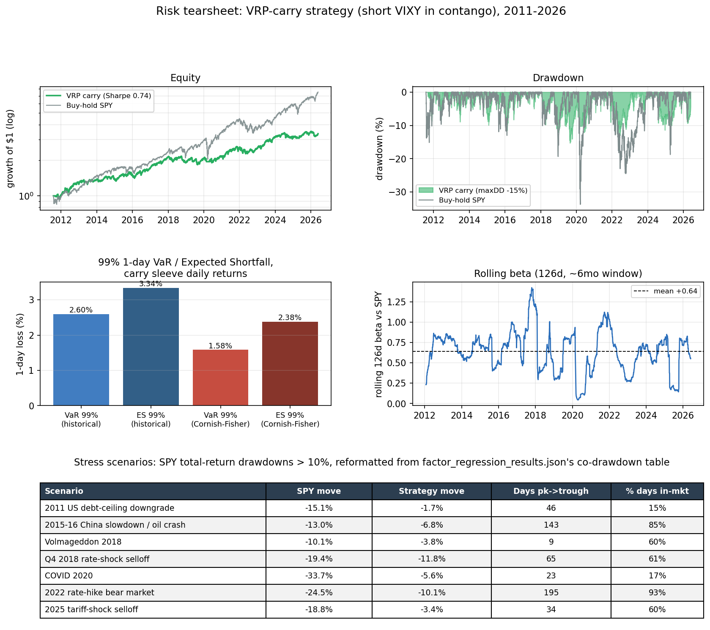

# Short-Volatility Carry on SPY

Index options are structurally expensive. Investors pay up for crash protection they are unwilling to sell, so implied volatility prints persistently above the volatility that actually realizes, and the front of the VIX futures curve sits in contango, each contract rolling down toward a lower spot as it nears expiry. A seller of that curve earns both halves of the gap at once: the spread of implied over realized, and the roll-down as the future converges. Together they are the variance risk premium. The premium is well-documented and dangerous in equal measure, because it accrues quietly for years and then surrenders that accumulation in the few days of a volatility spike.

That asymmetry is the entire design problem. Selling volatility continuously means owning the tail, so this strategy sells only while the term structure is sloped in its favor: short VIXY whenever one-month implied trades below three-month (`VIX < VIX3M`), flat otherwise. Because the curve typically inverts *before* a spike rather than during it, the rule has the position closed by the time the damage lands. Over 2011–2026 (3,731 trading days, every short-vol blowup in the sample), net of costs and borrow, it compounds at **8.5%/yr against a −15% maximum drawdown** (excess of cash; roughly 10%/yr in total-return terms), under half of what SPY surrendered through Volmageddon and COVID. The fill convention is reported, not hidden: with fills at the next morning's open instead of the same close, the drawdown is −20%, still well under SPY's −34% (§5).

Runnable evidence: [`analysis/strategy_two_sleeve.py`](analysis/strategy_two_sleeve.py). The companion [`FINDINGS.md`](FINDINGS.md) is the signal investigation behind one of the inputs (does dealer gamma carry volatility information beyond VIX).

**Related work, and what this document adds.** Shorting VIX futures or their ETPs when the term structure is in contango is a published trade, not a discovery made here. Simon and Campasano (2014) document the VIX futures basis as a tradeable signal; Cooper (2013) builds the ETP versions; Whaley (2013) quantifies the ETP roll decay; Alexander and Korovilas (2012) examine the products' behavior across regimes; Cheng (2019) prices the premium's time variation. What this document adds is the evidence standard: a 2011–2026 test window that contains every modern short-vol blowup at full severity, cost and borrow treated as first-class, selection-aware inference over every variant tried, and a demonstration that ML sizing layers and dealer-flow overlays do not improve the published rule (§4b–4d). References are listed at the end.

---

## 1. The premium and the vehicle

The premium has two sources, and both are mechanical rather than predictive. The first is the gap between implied and realized variance: VIX prices the market's demand for protection, and that demand keeps implied richer than what subsequently realizes most of the time. The second is roll yield: when the futures curve slopes upward, a long position rolls *up* the curve into a cheaper contract each day and bleeds, which means the short side collects that bleed. Neither requires a forecast. Both pay simply for holding the position while the curve cooperates.

The vehicle is **short VIXY** (ProShares VIX Short-Term Futures ETF, inception Jan-2011), which rolls the front two VIX-futures months. From the negative roll yield it decays at roughly **−48%/yr**, losing essentially all of its value long-only over the window, so shorting it harvests the VRP and the roll directly. VIXY matters here for a second reason: it is a single, un-spliced, free series that lived through every disaster in the modern short-vol record. August 2015, Volmageddon (Feb-2018), the COVID crash (Mar-2020), and 2022 are all in the sample at full severity. The blowups that liquidated the XIV note are not smoothed over; they are exactly what the strategy has to survive. VIXY is also chronically hard to borrow, which is why the cost analysis in §5 treats borrow as the binding cost rather than an afterthought.

## 2. The rule

> **Short a fixed, modest notional of VIXY whenever `VIX < VIX3M`. Flatten otherwise.**

`VIX/VIX3M` is the most-documented term-structure signal there is, and no parameter in the rule was fit on this sample: the rule comes from the prior literature, and the boundary at `1.0` is the structural point where the curve crosses from contango into backwardation (`VIX = VIX3M`), not a fitted threshold. Both indices are end-of-day, so the signal is read from the prior close and the position is held over the next close-to-close day, which removes any look-ahead (the no-lookahead invariant is enforced by a future-perturbation test; see §9). P&L is close-to-close, costs are 10 bps per unit of turnover, and the short pays a borrow fee that §5 stresses across a wide range.

## 3. Performance

Both the strategy and "SPY (excess)" are quoted excess of the risk-free rate (avg ≈ 1.6%/yr over the window); "SPY (total)" is the figure investors actually quote for buy-and-hold.

| | Sharpe | Sortino | Calmar | CAGR | Ann vol | maxDD |
|---|---|---|---|---|---|---|
| **Contango-filtered carry** | 0.74 | 0.81 | **0.56** | 8.5% | 11.9% | **−15.3%** |
| Buy-hold SPY (excess-of-rf) | 0.78 | 0.96 | 0.38 | 12.7% | 17.2% | −33.8% |
| Buy-hold SPY (total return) | 0.88 | 1.07 | 0.43 | 14.6% | 17.2% | −33.7% |
| 0.6x SPY (vol-matched, excess) | 0.78 | 0.96 | 0.37 | 7.8% | 10.3% | −21.3% |

The carry compounds 3.3x over the window on under half of SPY's drawdown, and it does so with a left tail (skew −1.31, kurtosis 6.1) that is the signature of the premium it harvests: shorting volatility means being paid to carry exactly that downside. The edge the data supports is depth: the maximum drawdown is under half of SPY's (−15% vs −34%), and in a paired block-bootstrap it is the shallower of the two in 96% of resamples (§5). The Calmar gap (0.56 vs 0.38) is economically large, but its bootstrap CI is wide and spans zero, so it is quoted as a magnitude, not a significance claim. On Sharpe and Sortino it runs just behind buy-and-hold SPY, which is the more efficient pure *return* engine; §4e places that comparison in its proper context.


**It dodges the blowups, verified in-sample.** The filter flattens the short as the term structure inverts into a spike, then re-enters once the curve normalizes:

| Event | strategy P&L over window | long-VIXY move | time in-market |
|---|---|---|---|
| **Volmageddon 2018** | **−3.9%** | +75% | 54% |
| **COVID crash 2020** | **−5.6%** | +273% | 12% |
| 2022 bear | −1.9% | −25% | 94% |

A daily signal cannot react inside the intraday Feb-5-2018 spike, which is the −3.9% figure, but it sidesteps the catastrophe that a constant short walks straight into.

## 4. Where the profit comes from

### 4a. Attribution: the contango filter is the lever

Building the position one control at a time isolates which decision earns the risk-adjusted return:

| Construction | Sharpe | Calmar | maxDD |
|---|---|---|---|
| 1. constant short, no controls | 0.57 | 0.23 | −31.9% |
| 2. + causal vol-targeting (no filter) | 0.44 | 0.22 | −23.1% |
| 3. **+ contango filter (headline)** | **0.74** | **0.56** | **−15.3%** |
| &nbsp;&nbsp;&nbsp;alt: continuous roll-yield sizing | 0.63 | 0.38 | −32.0% |
| 4. + extra signal gates (gamma/vvix/vix_z/liq) | 0.45 | 0.26 | −14.2% |

A constant short already earns the premium (Sharpe 0.57), but it pays for it with a −32% drawdown. Vol-targeting alone is roughly neutral on VIXY, because the asset's payoff is driven by where it sits on the curve rather than by recent realized vol. The contango filter is what converts the raw premium into a managed one: it more than doubles Calmar (0.23 → 0.56) and halves the drawdown (−32% → −15%) by simply being absent during the regime that produces the losses. Layering further gates on top (row 4) only sacrifices carry without buying additional protection.


### 4b. Signal attribution: nothing improves on the filter

Adding any single risk signal *on top of* the contango filter moves the metrics the wrong way (Δ vs the filter-only headline):

| Add-on | ΔSharpe | ΔCalmar | verdict |
|---|---|---|---|
| + dealer gamma (reduce on neg-γ) | −0.05 | −0.07 | null, consistent with [`FINDINGS.md`](FINDINGS.md) |
| + vol-of-vol (VVIX z) | −0.10 | −0.14 | hurts |
| + VIX z-score | −0.08 | −0.03 | hurts (marginal maxDD help only) |
| + liquidity (Amihud) | −0.07 | −0.10 | hurts |

Dealer gamma adding essentially nothing here is the trading-side corroboration of the signal study: gamma's incremental information beyond VIX is real but tiny, and a position overlay is exactly where tiny rounds to zero. The term-structure signal already prices the regime these add-ons are trying to detect.

### 4c. A learned sizing layer was tested and does not beat the rule

The natural next question is whether the binary in/out gate leaves size on the table, so I built a walk-forward regularized-linear (Ridge) model that predicts next-day carry from the term structure, vol-of-vol, realized-vol lags, and gamma, then sizes the short to the predicted magnitude. It does not help. Sizing the magnitude *within* the contango gate returns Calmar 0.29 at a −17% drawdown, and letting the model *replace* the gate entirely returns Calmar 0.11 at −32%, against the rule's 0.56 and −15%; the learned variants' Deflated Sharpe (0.16–0.35) sits well below the rule's 0.66–0.81. The model is causal by construction (expanding walk-forward, train-only scaling, an expanding exposure normaliser) and held to the same no-lookahead test as the rest of the book. The term structure already prices what the model is trying to learn, so the parameter-free rule ships.

### 4d. A direction sleeve was tested and is a coin flip

A walk-forward logistic (expanding window, monthly refit, 5-day embargo, train-only scaling) predicting next-day SPY direction from DIX flow, dealer gamma, trend, momentum, VIX regime, and relative volume scores an out-of-sample AUC of **0.51**. The fit collapses to closet-long (70% long, 3% short, +0.75 correlated to SPY). DIX and the other daily signals do not predict next-day SPY direction, so the sleeve is reported as the null it is and excluded from the book.

### 4e. What it is, in portfolio terms

The carry is **+0.61 correlated to SPY**, which is the identity of the premium rather than a flaw in the strategy: selling volatility is being short tail risk, which loads on the same bad states as being long equity. That is why its Sharpe lands near SPY's, and why blending it into an equity book does not lift the book's Sharpe much. The differentiation is the drawdown profile, not diversification. The strategy is a capital-efficient way to hold a beta-like risk premium at under half the equity drawdown.

The regression version of that identity ([`analysis/factor_regression.py`](analysis/factor_regression.py)): SPY beta 0.42 (HAC t = 6.4), annualized alpha +3.2% at t = 1.3, not significant; adding the Fama-French five factors and momentum moves the alpha to +3.5% (t = 1.4) with no meaningful loadings beyond the market. The strategy therefore claims no uncorrelated alpha. What the factor view adds is where the beta lives: 0.18 on SPY up-days, 0.42 on down-days, 0.71 while the book is in-market, 0.00 while flat, and +0.01 (t = 0.1) across SPY's worst decile of days, where the filter has already cut the exposure. One caveat stays in view: the book is still in-market on 81% of worst-decile days and takes a level loss there (mean −1.2%/day), so the tail protection is a vanished slope plus the episode record below, not immunity.

| SPY drawdown > 10% | SPY (total return) | strategy, same dates | time in-market |
|---|---|---|---|
| 2011 debt-ceiling | −15.1% | **−1.7%** | 15% |
| 2015–16 | −13.0% | −6.8% | 85% |
| Volmageddon 2018 | −10.1% | −3.8% | 60% |
| Q4 2018 | −19.4% | −11.8% | 61% |
| COVID 2020 | −33.7% | **−5.6%** | 17% |
| 2022 bear | −24.5% | −10.1% | 93% |
| 2025 | −18.8% | −3.4% | 60% |

## 5. Robustness

- **Borrow is the binding cost.** Turnover is light (~12 flips/yr), so the bid-ask spread barely matters (5 → 30 bps moves Sharpe ~0.05). But the book is short, and therefore paying borrow, on ~92% of days, and VIXY is chronically hard to borrow, so borrow is a near-constant drag rather than a rare-stress one:

  | VIXY borrow (%/yr) | 0 | 3 (headline) | 5 | 8 | 12 | 18 | 25 |
  |---|---|---|---|---|---|---|---|
  | carry Sharpe | 0.79 | 0.74 | 0.71 | 0.67 | 0.60 | 0.51 | 0.40 |
  | carry Calmar | 0.61 | 0.56 | 0.52 | 0.47 | 0.40 | 0.31 | 0.21 |

  A VIX-conditioned borrow (base 5% plus a stress add-on, averaging ~6% on short days) leaves Sharpe 0.69, Calmar 0.51, maxDD −16%. The drawdown edge over SPY holds out past 20%/yr borrow; the Sharpe never overtakes SPY's once any realistic borrow is charged.

- **Execution lag is measured, not assumed.** VIX-family indices print until 4:15pm ET while VIXY stops trading at 4:00pm, so the headline's same-close fill is optimistic. Repricing the fills ([`analysis/execution_lag.py`](analysis/execution_lag.py)):

  | fill | Sharpe | Calmar | maxDD | CAGR |
  |---|---|---|---|---|
  | t−1 close (headline) | 0.74 | 0.56 | −15.3% | 8.5% |
  | next open | 0.73 | 0.42 | −20.1% | 8.4% |
  | next close (+1 full day) | 0.54 | 0.21 | −28.4% | 6.1% |

  The realistic next-open fill leaves the return engine intact and pays in drawdown: exits hold the short through one overnight gap, and VIXY gaps hardest on exactly the nights the curve inverts (the Feb 1–15, 2018 window costs −1.8% at the close print and −8.8% under a full extra day of lag). The signal itself is stable at the 4:00pm cutoff: of ~12.5 flips per year, ~3.6 sit within 1% of the contango boundary. Roughly a quarter of the headline drawdown advantage is fill convention, which is why the depth claim is quoted against the next-open row as well (−20% remains well under SPY's −34%).

- **Deflated Sharpe = 0.66–0.81** (N=22 variants). The lower bound uses the empirical Sharpe dispersion across a genuinely diverse trial set; the upper bound uses the theory-grounded Bailey–López-de-Prado per-trial null. A DSR comfortably above 0.5 across that range is the selection-aware bar the strategy clears. Holding that same dispersion fixed and asking what the bar would be under more trials than were actually run: 0.51–0.72 at a hypothetical N=50 and 0.38–0.63 at N=100. The theory-grounded (H0) estimate stays above 0.5 out to 10x the trials actually tried; the empirical-dispersion estimate does not, dropping below 0.5 by N=100. The conclusion is not an unqualified order-of-magnitude-robust result, it depends on which dispersion estimate is trusted, and the empirical one is more conservative here.

- **Block-bootstrap 95% CI on Sharpe: [+0.27, +1.20]; P(Sharpe ≤ 0) = 0.001.** This is significance versus zero with no multiple-testing adjustment; the selection-aware bar is the DSR above.

- **Inference on the drawdown edge (paired bootstrap).** A paired stationary bootstrap (5,000 draws, 90-day mean blocks, the same resampled dates applied to strategy and SPY; [`analysis/drawdown_inference.py`](analysis/drawdown_inference.py)) supports the depth claim and disciplines the ratio claim. The strategy's maximum drawdown is shallower than SPY's in **96% of draws**, and P(strategy maxDD worse than −25%) = 7.5%. The ΔCalmar 95% CI is [−0.38, +0.52] and spans zero (P(ΔCalmar > 0) = 0.63), so the Calmar gap is reported as an economic magnitude only. Block length matters: 15-day blocks chop the multi-week crisis clustering and flatter the tail (P(maxDD < −25%) rises to 0.24), so drawdown claims use 90-day mean blocks, with 180-day blocks in agreement. Resampled drawdowns measure dispersion under block resampling, not a forecast of the next realized drawdown.

- **Sub-period stability.** No true holdout exists for a rule taken from the published literature, so these splits measure stability rather than out-of-sample skill:

  | Sub-period | carry Sharpe (HAC t) | carry Calmar | maxDD | SPY-excess Sharpe |
  |---|---|---|---|---|
  | 2011–2018 | +0.82 (t=2.4) | 0.75 | −12% | 0.78 |
  | 2019–2026 | +0.67 (t=2.1) | 0.60 | −13% | 0.80 |
  | 2018+ (post-XIV) | +0.50 (t=1.6) | 0.37 | −15% | 0.68 |

  The edge roughly halves after 2018 (post-XIV, post-0DTE) but stays positive, and a forward-looking reader should anchor on the recent-regime Sharpe of ~0.50, not the pooled 0.74. A rolling 756-day (3y) view tells the same story continuously rather than at three fixed cut points ([`analysis/make_figure_strategy.py`](analysis/make_figure_strategy.py), `strategy_rolling.png`): the rolling Sharpe never goes negative across 2,976 windows (min 0.00, median 0.76), but the rolling Calmar only clears SPY's rolling Calmar in 54% of windows, so the Calmar edge is a persistent tilt, not a reliable win in every 3-year stretch.

- **Per-regime significance.** With HAC t-stats and a 3-block multiplicity caveat: pre-2020 Sharpe +0.81 (t=2.52, significant); 2020–21 +0.83 (t=1.42, not significant, n=505); 2022+ +0.57 (t=1.35, not significant). The positive 2020–21 and 2022+ point estimates collapse toward their minus-top-3-days figures (+0.59, +0.42) and should not be read as robust on their own.

- **Threshold stability.** Across contango thresholds 0.97–1.05 the Sharpe spans 0.56–0.77, all positive; the structural `1.00` gives 0.74 and is not the grid maximum (1.05 → 0.77), so it is not cherry-picked.

- **Few-days fragility.** Sharpe minus the single best day is 0.73, minus top-5 is 0.67, minus top-10 is 0.61. The result is not a handful of lucky sessions.

- **Capacity.** A flip trades the whole 0.2x book (`analysis/capacity.py` -> `capacity_results.json`); VIXY's typical dollar ADV (full-sample median of the 21-day rolling median) is ~$46.5M, most recently ~$80.6M:

  | Book size | Flip trade | % of typical ADV | % of recent ADV |
  |---|---|---|---|
  | $1M | $200K | 0.43% | 0.25% |
  | $10M | $2M | 4.30% | 2.48% |
  | $50M | $10M | 21.50% | 12.41% |

  At ~12.5 flips/yr a $1–10M book is a rounding error on VIXY's tape; a $50M book starts to move the market on flip days, and VIXY is a note, not a future, so its own liquidity caps how much of this can be run in this vehicle at all. That, together with the borrow drag above, is why a futures-level implementation (the SPVXSTR roll, §6/§7) is the version that scales, not this ETF proxy. VIXY is also chronically hard to borrow, and locate availability tends to tighten exactly when the trade wants to be on (into a vol spike), which is a qualitative risk this backtest cannot size from free data.

- **Cross-vehicle generalization.** The same zero-parameter rule, unmodified, run on three other
  vol ETPs at the identical 0.20 notional ([`analysis/cross_vehicle.py`](analysis/cross_vehicle.py)):

  | Vehicle | Window | Sharpe | Calmar | maxDD |
  |---|---|---|---|---|
  | VIXY (headline) | 2011–2026 | 0.74 | 0.56 | −15.3% |
  | VXX (short) | 2018–2026 | 0.53 | 0.38 | −15.5% |
  | VIXY, same window as VXX | 2018–2026 | 0.51 | 0.37 | −15.3% |
  | SVXY (long, no borrow), pooled | 2011–2026 | 0.74 | 0.56 | −11.5% |
  | SVXY, pre deleverage (−1x) | 2011–2018-02 | 1.01 | 1.00 | −11.5% |
  | SVXY, post deleverage (−0.5x) | 2018-02–2026 | 0.45 | 0.32 | −8.3% |
  | UVXY (short, 2x) | 2011–2026 | 0.86 | 0.76 | −22.2% |

  VXX (the relaunched note, 2018→ only) tracks VIXY closely over the identical dates: both
  sit around Sharpe 0.5 in this lower-Sharpe post-2018 sub-period, and VXX's maxDD is
  marginally worse (−15.5% vs −15.3%), consistent with the two products sharing the same
  underlying VIX-futures roll with small fee/methodology differences. SVXY, going long in
  contango, needs no borrow at all, which answers the "why pay borrow shorting a hard-to-
  borrow ETF" question directly: over 2011–2018 (still −1x) it actually posts the strongest
  numbers in the table (Sharpe 1.01, Calmar 1.00), but ProShares' February 2018 deleverage to
  −0.5x roughly halves both Sharpe and Calmar for the second half of the sample. The two
  periods are never pooled into one claim because they are different products in substance,
  a −1x fund before 2018-02-28 and a −0.5x fund after. UVXY's 2x leverage cuts the other way:
  it posts the best Sharpe and Calmar of any vehicle in the table, but by far the worst
  drawdown (−22.2%, well past the −15.3% headline and the −20.1% next-open-fill number in the
  execution-lag row above), the leverage-decay-and-tail tradeoff showing up exactly where it
  should. None of this is borrow-free ETF alchemy: VIXY and VXX both pay the SAME borrow
  drag documented above, and SVXY's own -0.5x-fund NAV decay is a real cost baked into its
  price rather than a borrow line item, just a differently-shaped one.

- **ETF-free implementation: real VIX futures, not the ETP wrapper.** Everything above trades
  VIXY/VXX/SVXY/UVXY, index-tracking products with their own fees and NAV decay. CBOE's free
  per-contract settlement archive turns out to be badly incomplete once probed directly
  ([`ingest/vix_futures_pull.py`](ingest/vix_futures_pull.py)): gap-free and correctly scaled
  against spot VIX only for 2008-01–2013-12, patchy for 2014–2018 (front 8 months only), and
  the whole archive stops dead after 2018-02-23. Extending past that needs a paid feed (CBOE
  DataShop or Databento's CFE feed), out of scope at this project's $0 budget. Within the
  clean 2008–2013 window, [`analysis/vix_futures_curve.py`](analysis/vix_futures_curve.py)
  builds a constant-30-day-maturity short directly on the front two VX contracts: no ETP
  wrapper and no borrow, since this is a real futures short funded by margin, not a stock
  loan. It tracks VIXY's own daily returns closely where the two overlap:

  | | Window | Sharpe | Calmar | maxDD |
  |---|---|---|---|---|
  | VX constant-maturity short (no borrow) | 2008–2013 | 1.10 | 1.05 | −11.9% |
  | VIXY, 2011–2013 subset (no 2008–2010 data) | 2011–2013 | 1.14 | 1.48 | −8.9% |
  | VX constant-maturity short, matched to VIXY's dates | 2011–2013 | 0.86 | 0.98 | −11.0% |

  Daily-return correlation between the two constructions over the 2011–2013 overlap is 0.96,
  confirming the futures build is a faithful reconstruction of the same roll VIXY tracks, not
  a different signal. But on the identical dates the futures version does not beat the ETP:
  Sharpe 0.86 vs VIXY's 1.14, Calmar 0.98 vs 1.48, despite paying zero borrow. Removing the
  borrow drag was not enough to offset the approximation in a 30-day-constant-maturity
  weighting against VIXY's own, more granular roll in this sample. This does not settle the
  capacity question above (a book too large for VIXY's ADV would still need the futures
  market), but it does mean "no borrow" alone is not a free Sharpe upgrade here.

- **Term-structure PCA sizing, on the real futures curve.** §7 below proposes replacing the
  binary contango switch with a signal sized to the roll's predicted magnitude, noting that a
  crude continuous version (sizing on the VIX3M-VIX slope directly) already under-performs the
  binary gate. [`analysis/vix_futures_term_pca.py`](analysis/vix_futures_term_pca.py) tries a
  properly walk-forward version instead, on the real futures curve rather than the two-index
  proxy: six constant-maturity tenors (30-180 days, from the same clean 2008-2013 window), a
  causal PCA (expanding window, monthly refit, 5-day embargo, matching this repo's existing
  ML-sizing convention) extracting a slope score (PC2, sign-fixed each refit against measured
  contango depth), used to continuously scale the existing binary gate rather than replace it.
  On the post-warmup test window (n=931, 2010-2013):

  | | Sharpe | Calmar | maxDD | Hit rate |
  |---|---|---|---|---|
  | Binary gate (same matched window) | 1.10 | 1.13 | −12.3% | 55.7% |
  | PCA slope-scaled gate | 1.64 | 2.23 | −8.8% | 30.5% |

  This is a real effect in this sample, not a single lucky day: HAC t=3.24; Sharpe only drops
  to 1.09 with the ten best days removed (back to roughly the binary gate's own level, not
  below it); the first and second half of the test window post similar Sharpes (1.81, 1.46).
  The hit rate falls because the multiplier sits at zero on about half the days the binary
  gate would be short (no confirmed extra contango depth that period), so this is a fewer,
  better-timed-bets profile, not a higher-hit-rate one. But it is a SINGLE untuned
  specification (six tenors, a 2.0x cap, monthly refits, none swept or cross-validated) on a
  narrow six-year, 931-observation window, with no multiplicity adjustment computed the way
  the headline's 22-variant deflated Sharpe was. Read this as a promising proof of concept for
  walk-forward carry-magnitude sizing on the real futures curve, not a validated result.

- **Black-76 groundwork for the tail floor.** §7 also proposes a convex left-tail floor (a
  VIX-call ladder) sized as negative carry.
  [`analysis/black76.py`](analysis/black76.py) is the pricing primitive (validated against
  put-call parity and the standard zero-vol/deep-ITM/deep-OTM boundary limits), and
  [`analysis/black76_tail_floor_demo.py`](analysis/black76_tail_floor_demo.py) demonstrates it
  on the constant-maturity futures curve: a 30-day, 20%-OTM call averaged 1.9% of the forward
  level across 2008-2013 (median 1.3%, range 0.2-6.8%). This is illustrative, not a real
  quote: no VIX-options market data is ingested in this project, so sigma is a trailing-60-day
  realized-vol proxy, not an implied vol, and real VIX-option IV trades persistently above
  realized vol (the same premium the whole strategy sells), so every number here understates
  the real hedge cost. One genuine finding survives that caveat: the proxy price was CHEAPER
  than the sample average right before two of the three crisis snapshots checked (0.99% of
  forward the day before Lehman, 0.79% the day before the 2010 flash crash, against a 1.9%
  mean), the same blind spot a realized-vol-only hedge would have had walking into both.

- **Data staleness and margin.** The contango flag is never computed from a stale print: in the current data vintage VIX3M is present on every panel day (zero forward-filled observations; VVIX needs 8). Shorting VIXY draws elevated house margin, often 100% of notional or more, but at the 0.2x book used here the position is comfortably financeable; the binding cost is borrow, not margin.

- **Gap risk, quantified.** §6 below states qualitatively that a true overnight gap through the daily contango gate is the residual risk a once-a-day signal cannot hedge. A regime-conditional stationary block bootstrap of the carry sleeve's own historical return stream ([`analysis/gap_risk_mc.py`](analysis/gap_risk_mc.py); 5,000 draws, 90-day mean block, seed 7; contiguous blocks keep the historical return and contango-gate regime label paired, so in-market crisis clustering survives resampling) puts a number on it: P(maxDD worse than −20%) = 29%, P(maxDD worse than −25%) = 8%, P(maxDD worse than −30%) = 2%, against the realized −15% headline. Block length matters in the same direction it does for the paired bootstrap above: a 30-day mean block (less crisis-clustering credit) raises these to 50%/18%/6%, a 180-day block lowers them to 17%/3%/1%. This resamples the rule's own historical dynamics, not a forecast of the next drawdown, but it is a materially wider tail than the single realized path shows.

## 6. Limitations

- **Fill convention.** There is no intraday execution, and §5 quantifies what that costs: next-open fills deepen the maximum drawdown to −20%, and a full day of signal lag roughly halves the strategy. The daily signal cannot react within a crash day; the −3.9% Volmageddon figure reflects exactly that.
- **Borrow swings the result.** Net of realistic borrow the strategy keeps its drawdown advantage over SPY while giving up any Sharpe advantage, because the book pays borrow on nearly every day it is short.
- **It is short volatility.** The premium is real and so is the left tail (skew −1.31, kurt 6.1). The strategy is built to flatten *before* the gap, and a true overnight gap through the filter is the residual risk it cannot hedge with a daily signal.
- **Edge decay.** Post-2018 the Sharpe roughly halves; the recent-regime numbers (~0.50–0.57) are the right forward anchor, not the pooled 0.74.
- **Capacity and vehicle.** Results ride on VIXY's tradability and on `VIX/VIX3M` as the curve proxy. A futures-level, no-borrow implementation was tried (§5) but only a clean 2008–2013 free-data window is usable, and it did not clearly beat the ETP even there; extending it to the full sample needs a paid futures feed.

## 6a. Risk in standard vocabulary: VaR, ES, stress, beta

Everything above is stated in Sharpe/Calmar/drawdown terms. For a reader who thinks in VaR and Expected Shortfall, the same carry-sleeve return series ([`analysis/risk_tearsheet.py`](analysis/risk_tearsheet.py)) translates as: 99% 1-day historical VaR is **2.60%**, with Expected Shortfall (the average loss beyond that threshold) at **3.34%**. The sleeve's own recomputed skew and kurtosis (−1.31, 6.14) reconcile to §6's pooled headline numbers exactly. A Cornish-Fisher tail adjustment, which corrects a Gaussian quantile for sample skew and kurtosis, gives a smaller pair here: VaR **1.58%**, ES **2.38%**. That is not the adjustment working as usually advertised: decomposing the expansion shows the negative-skew terms (−0.96 from the linear skew term, −0.65 from the skew² term) dominate the positive kurtosis term (+1.43), pulling the adjusted quantile in *less* conservative than plain Gaussian, let alone historical. This is a known breakdown mode of the Cornish-Fisher expansion at large negative skew, not evidence the true tail is thinner, so the historical estimate, which needs no distributional assumption, is the one to anchor sizing on, not the parametric correction.

The co-drawdown table from §4e reformats directly into a stress-scenario table, unchanged in substance (source: `analysis/factor_regression_results.json`, not recomputed):

| Scenario | SPY move | Strategy move | % days in-market |
|---|---|---|---|
| 2011 US debt-ceiling downgrade | −15.1% | −1.7% | 15% |
| 2015–16 China slowdown / oil crash | −13.0% | −6.8% | 85% |
| Volmageddon 2018 | −10.1% | −3.8% | 60% |
| Q4 2018 rate-shock selloff | −19.4% | −11.8% | 61% |
| COVID 2020 | −33.7% | −5.6% | 17% |
| 2022 rate-hike bear market | −24.5% | −10.1% | 93% |
| 2025 tariff-shock selloff | −18.8% | −3.4% | 60% |

A 126-day (~6-month) rolling beta against SPY ranges from **+0.04 to +1.42** (mean +0.64, current +0.55), wider swings than the static full-sample CAPM beta of 0.42 (§4e) shows on its own. The two are not in conflict: the full-sample pooled beta recomputed here is 0.4247, matching §4e's static CAPM beta of 0.4247 almost exactly; the gap to the 0.64 rolling mean is a genuine time-varying-exposure fact; the mean of many short-window ratios is not the same statistic as one ratio computed on the pooled sample. The book's rolling beta rises around 2018 and again through 2022, consistent with §4e's finding that the beta concentrates on down-days and while the book is in-market: the static beta describes the average exposure, the rolling beta shows when that exposure is elevated.



## 7. Where this goes next

The three highest-value free-data upgrades all attack the *drawdown*, which is the strategy's actual edge, rather than chasing a Sharpe it structurally cannot win:

1. **Continuous, magnitude-scaled roll/slope sizing** to replace the binary switch, sizing on the *predicted magnitude* of the roll rather than its sign. A crude version (sizing directly on the VIX3M-VIX slope) already under-performs the binary gate; a properly walk-forward PCA slope score on the real futures curve looks considerably better in a narrow 2008-2013 test (§5), but it is one untuned specification on 931 observations with no multiplicity sweep, so validating it the way the headline strategy is validated (a variant sweep, a deflated Sharpe) is the next step before it earns any more weight than a proof of concept.
2. **Explicit forward-VRP conditioning**: size on model-free implied variance minus a Yang–Zhang realized-variance forecast, cutting exposure as the *ex-ante* premium collapses, which is the regime that precedes blowups.
3. **A convex left-tail floor** (a VIX-call ladder or SPX put-spread) sized as negative carry, to cap the one thing a daily term-structure gate provably cannot defend: the intraday Feb-2018-style spike. The pricing primitive exists now (§5, Black-76), but it needs real VIX-options quotes, not a realized-vol proxy, before it prices anything but a lower bound.

The dead-ends are equally clear and not worth relitigating: gamma/DIX timing (a VIX echo, see `FINDINGS.md`), naive vol-targeting (neutral on VIXY), fixed roll-yield thresholds (a textbook out-of-sample failure), and backwardation as a re-entry timer. The structural verdict stands: daily short-vol is a beta-like premium, and its only durable differentiation is the drawdown profile.

## 8. Reproduce

```bash
# env with numpy/scipy/scikit-learn/pandas/pyarrow + matplotlib
python -m ingest.deep_pull               # fetch the free inputs; sha256 manifest + VIXY split check
python analysis/strategy_two_sleeve.py   # full backtest + tables -> strategy_results.json
python analysis/execution_lag.py         # fill-convention sensitivity -> execution_lag_results.json
python analysis/factor_regression.py     # CAPM/FF6, state betas, co-drawdowns -> factor_regression_results.json
python analysis/drawdown_inference.py    # paired bootstrap on the drawdown edge -> drawdown_inference_results.json
python analysis/gap_risk_mc.py           # regime-conditional gap-risk bootstrap -> gap_risk_mc_results.json
python analysis/capacity.py              # flip size vs VIXY dollar ADV -> capacity_results.json
python analysis/risk_tearsheet.py        # VaR/ES, stress table, rolling beta -> risk_tearsheet_results.json
python analysis/make_figure_tearsheet.py # one-page risk tearsheet figure
python analysis/make_figure_strategy.py  # the three figures (headline, research, rolling)
```

Data is fetched, not committed (SqueezeMetrics' terms bar redistribution and price history is large): SqueezeMetrics GEX/DIX, CBOE VIX, yfinance SPY/VIXY/VIX-family, FRED DGS3MO. The fetcher pins the window end to the vintage behind the committed results (pass `--end` to extend) and records every file in `data/raw/deep_manifest.json`. Window 2011-07 → 2026-05.

## References

- Alexander, C. and D. Korovilas (2012). *Diversification of Equity with VIX Futures: Personal Views and Skewness Preference.* Working paper, ICMA Centre.
- Cheng, I.-H. (2019). *The VIX Premium.* Review of Financial Studies 32(1), 180–227.
- Cooper, T. (2013). *Easy Volatility Investing.* SSRN working paper 2255327.
- Simon, D. and J. Campasano (2014). *The VIX Futures Basis: Evidence and Trading Strategies.* Journal of Derivatives 21(3), 54–69.
- Whaley, R. (2013). *Trading Volatility: At What Cost?* Journal of Portfolio Management 40(1), 95–108.
