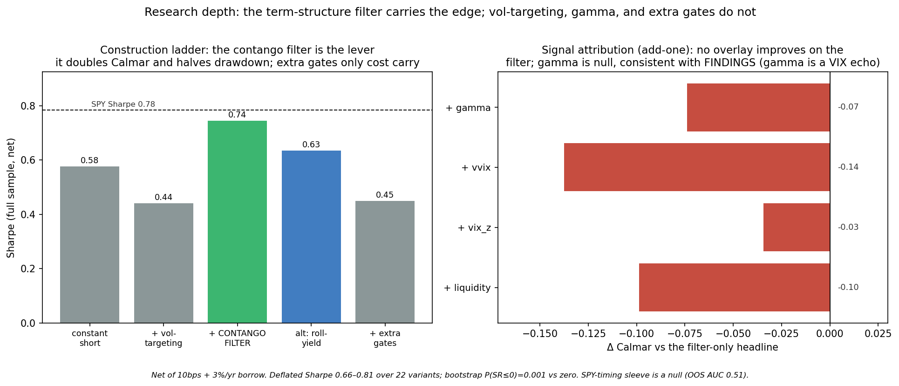

# Short-Volatility Carry on SPY

Index options are structurally expensive. Investors pay up for crash protection they are unwilling to sell, so implied volatility prints persistently above the volatility that actually realizes, and the front of the VIX futures curve sits in contango, each contract rolling down toward a lower spot as it nears expiry. A seller of that curve earns both halves of the gap at once: the spread of implied over realized, and the roll-down as the future converges. Together they are the variance risk premium. The premium is well-documented and dangerous in equal measure, because it accrues quietly for years and then surrenders that accumulation in the few days of a volatility spike.

That asymmetry is the entire design problem. Selling volatility continuously means owning the tail, so this strategy sells only while the term structure is sloped in its favor: short VIXY whenever one-month implied trades below three-month (`VIX < VIX3M`), flat otherwise. Because the curve typically inverts *before* a spike rather than during it, the rule has the position closed by the time the damage lands. Over 2011–2026 (3,730 trading days, every short-vol blowup in the sample), net of costs and borrow, it compounds at **8.5%/yr against a −15% maximum drawdown**, under half of what SPY surrendered through Volmageddon and COVID.

Runnable evidence: [`analysis/strategy_two_sleeve.py`](analysis/strategy_two_sleeve.py). The companion [`FINDINGS.md`](FINDINGS.md) is the signal investigation behind one of the inputs (does dealer gamma carry volatility information beyond VIX).

---

## 1. The premium and the vehicle

The premium has two sources, and both are mechanical rather than predictive. The first is the gap between implied and realized variance: VIX prices the market's demand for protection, and that demand keeps implied richer than what subsequently realizes most of the time. The second is roll yield: when the futures curve slopes upward, a long position rolls *up* the curve into a cheaper contract each day and bleeds, which means the short side collects that bleed. Neither requires a forecast. Both pay simply for holding the position while the curve cooperates.

The vehicle is **short VIXY** (ProShares VIX Short-Term Futures ETF, inception Jan-2011), which rolls the front two VIX-futures months. From the negative roll yield it decays at roughly **−48%/yr**, losing essentially all of its value long-only over the window, so shorting it harvests the VRP and the roll directly. VIXY matters here for a second reason: it is a single, un-spliced, free series that lived through every disaster in the modern short-vol record. August 2015, Volmageddon (Feb-2018), the COVID crash (Mar-2020), and 2022 are all in the sample at full severity. The blowups that liquidated the XIV note are not smoothed over; they are exactly what the strategy has to survive. VIXY is also chronically hard to borrow, which is why the cost analysis in §5 treats borrow as the binding cost rather than an afterthought.

## 2. The rule

> **Short a fixed, modest notional of VIXY whenever `VIX < VIX3M`. Flatten otherwise.**

`VIX/VIX3M` is the most-documented term-structure signal there is, and the rule carries no tuned threshold: the boundary at `1.0` is the structural point where the curve crosses from contango into backwardation (`VIX = VIX3M`), not a fitted parameter. Both indices are end-of-day, so the signal is read from the prior close and the position is held over the next close-to-close day, which removes any look-ahead (the no-lookahead invariant is enforced by a future-perturbation test; see §9). P&L is close-to-close, costs are 10 bps per unit of turnover, and the short pays a borrow fee that §5 stresses across a wide range.

## 3. Performance

Both the strategy and "SPY (excess)" are quoted excess of the risk-free rate (avg ≈ 1.6%/yr over the window); "SPY (total)" is the figure investors actually quote for buy-and-hold.

| | Sharpe | Sortino | Calmar | CAGR | Ann vol | maxDD |
|---|---|---|---|---|---|---|
| **Contango-filtered carry** | 0.74 | 0.81 | **0.56** | 8.5% | 11.9% | **−15.3%** |
| Buy-hold SPY (excess-of-rf) | 0.78 | 0.96 | 0.38 | 12.7% | 17.2% | −33.8% |
| Buy-hold SPY (total return) | 0.88 | 1.07 | 0.43 | 14.6% | 17.2% | −33.7% |
| 60/40 (SPY/cash, excess) | 0.78 | 0.96 | 0.37 | 7.8% | 10.3% | −21.3% |

The carry compounds 3.3x over the window on under half of SPY's drawdown, and it does so with a left tail (skew −1.31, kurtosis 6.1) that is the signature of the premium it harvests: shorting volatility means being paid to carry exactly that downside. On a Calmar basis (0.56 vs 0.38) and on peak-to-trough drawdown (−15% vs −34%) it is the more capital-efficient way to be long the risk premium that equities also pay. On Sharpe and Sortino it runs just behind buy-and-hold SPY, which is the more efficient pure *return* engine; §4e places that comparison in its proper context.


**It dodges the blowups, verified in-sample.** The filter flattens the short as the term structure inverts into a spike, then re-enters once the curve normalizes:

| Event | strategy P&L over window | long-VIXY move | time in-market |
|---|---|---|---|
| **Volmageddon 2018** | **−3.9%** | +75% | 54% |
| **COVID crash 2020** | **−5.6%** | +273% | 12% |
| 2022 bear | −1.9% | −25% | 94% |

A daily signal cannot react inside the intraday Feb-5-2018 spike, which is the −3.9% figure, but it sidesteps the catastrophe that a constant short walks straight into.

## 4. Where the profit comes from

### 4a. Attribution: the contango filter is the lever

Building the position one control at a time isolates which decision earns the risk-adjusted return:

| Construction | Sharpe | Calmar | maxDD |
|---|---|---|---|
| 1. constant short, no controls | 0.57 | 0.23 | −31.9% |
| 2. + causal vol-targeting (no filter) | 0.44 | 0.22 | −23.1% |
| 3. **+ contango filter (headline)** | **0.74** | **0.56** | **−15.3%** |
| &nbsp;&nbsp;&nbsp;alt: continuous roll-yield sizing | 0.63 | 0.38 | −32.0% |
| 4. + extra signal gates (gamma/vvix/vix_z/liq) | 0.45 | 0.26 | −14.2% |

A constant short already earns the premium (Sharpe 0.57), but it pays for it with a −32% drawdown. Vol-targeting alone is roughly neutral on VIXY, because the asset's payoff is driven by where it sits on the curve rather than by recent realized vol. The contango filter is what converts the raw premium into a managed one: it more than doubles Calmar (0.23 → 0.56) and halves the drawdown (−32% → −15%) by simply being absent during the regime that produces the losses. Layering further gates on top (row 4) only sacrifices carry without buying additional protection.



### 4b. Signal attribution: nothing improves on the filter

Adding any single risk signal *on top of* the contango filter moves the metrics the wrong way (Δ vs the filter-only headline):

| Add-on | ΔSharpe | ΔCalmar | verdict |
|---|---|---|---|
| + dealer gamma (reduce on neg-γ) | −0.05 | −0.07 | null, consistent with [`FINDINGS.md`](FINDINGS.md) |
| + vol-of-vol (VVIX z) | −0.10 | −0.14 | hurts |
| + VIX z-score | −0.08 | −0.03 | hurts (marginal maxDD help only) |
| + liquidity (Amihud) | −0.07 | −0.10 | hurts |

Dealer gamma adding essentially nothing here is the trading-side corroboration of the signal study: gamma's incremental information beyond VIX is real but tiny, and a position overlay is exactly where tiny rounds to zero. The term-structure signal already prices the regime these add-ons are trying to detect.

### 4c. A learned sizing layer was tested and does not beat the rule

The natural next question is whether the binary in/out gate leaves size on the table, so I built a walk-forward regularized-linear (Ridge) model that predicts next-day carry from the term structure, vol-of-vol, realized-vol lags, and gamma, then sizes the short to the predicted magnitude. It does not help. Sizing the magnitude *within* the contango gate returns Calmar 0.29 at a −17% drawdown, and letting the model *replace* the gate entirely returns Calmar 0.11 at −32%, against the rule's 0.56 and −15%; the learned variants' Deflated Sharpe (0.16–0.35) sits well below the rule's 0.66–0.81. The model is causal by construction (expanding walk-forward, train-only scaling, an expanding exposure normaliser) and held to the same no-lookahead test as the rest of the book. The term structure already prices what the model is trying to learn, so the parameter-free rule ships.

### 4d. A direction sleeve was tested and is a coin flip

A walk-forward logistic (expanding window, monthly refit, 5-day embargo, train-only scaling) predicting next-day SPY direction from DIX flow, dealer gamma, trend, momentum, VIX regime, and relative volume scores an out-of-sample AUC of **0.51**. The fit collapses to closet-long (70% long, 3% short, +0.75 correlated to SPY). DIX and the other daily signals do not predict next-day SPY direction, so the sleeve is reported as the null it is and excluded from the book.

### 4e. What it is, in portfolio terms

The carry is **+0.61 correlated to SPY**, which is the identity of the premium rather than a flaw in the strategy: selling volatility is being short tail risk, which loads on the same bad states as being long equity. That is why its Sharpe lands near SPY's, and why blending it into an equity book does not lift the book's Sharpe much. The differentiation is the drawdown profile, not diversification. The strategy is a capital-efficient way to hold a beta-like risk premium at under half the equity drawdown.

## 5. Robustness

- **Borrow is the binding cost.** Turnover is light (~12 flips/yr), so the bid-ask spread barely matters (5 → 30 bps moves Sharpe ~0.05). But the book is short, and therefore paying borrow, on ~92% of days, and VIXY is chronically hard to borrow, so borrow is a near-constant drag rather than a rare-stress one:

  | VIXY borrow (%/yr) | 0 | 3 (headline) | 5 | 8 | 12 | 18 | 25 |
  |---|---|---|---|---|---|---|---|
  | carry Sharpe | 0.79 | 0.74 | 0.71 | 0.67 | 0.60 | 0.51 | 0.40 |
  | carry Calmar | 0.61 | 0.56 | 0.52 | 0.47 | 0.40 | 0.31 | 0.21 |

  A VIX-conditioned borrow (base 5% plus a stress add-on, averaging ~6% on short days) leaves Sharpe 0.69, Calmar 0.51, maxDD −16%. The drawdown edge over SPY holds out past 20%/yr borrow; the Sharpe never overtakes SPY's once any realistic borrow is charged.

- **Deflated Sharpe = 0.66–0.81** (N=22 variants). The lower bound uses the empirical Sharpe dispersion across a genuinely diverse trial set; the upper bound uses the theory-grounded Bailey–López-de-Prado per-trial null. A DSR comfortably above 0.5 across that range is the selection-aware bar the strategy clears.

- **Block-bootstrap 95% CI on Sharpe: [+0.27, +1.20]; P(Sharpe ≤ 0) = 0.001.** This is significance versus zero with no multiple-testing adjustment; the selection-aware bar is the DSR above.

- **Out-of-sample persistence.** The rule is parameter-light, but the edge should survive outside the period that framed it:

  | Sub-period | carry Sharpe (HAC t) | carry Calmar | maxDD | SPY-excess Sharpe |
  |---|---|---|---|---|
  | 2011–2018 | +0.82 (t=2.4) | 0.75 | −12% | 0.78 |
  | 2019–2026 | +0.67 (t=2.1) | 0.60 | −13% | 0.80 |
  | 2018+ (post-XIV) | +0.50 (t=1.6) | 0.37 | −15% | 0.68 |

  The edge roughly halves after 2018 (post-XIV, post-0DTE) but stays positive, and a forward-looking reader should anchor on the recent-regime Sharpe of ~0.50, not the pooled 0.74.

- **Per-regime significance.** With HAC t-stats and a 3-block multiplicity caveat: pre-2020 Sharpe +0.81 (t=2.52, significant); 2020–21 +0.83 (t=1.42, not significant, n=505); 2022+ +0.57 (t=1.35, not significant). The positive 2020–21 and 2022+ point estimates collapse toward their minus-top-3-days figures (+0.59, +0.42) and should not be read as robust on their own.

- **Threshold stability.** Across contango thresholds 0.97–1.05 the Sharpe spans 0.56–0.77, all positive; the structural `1.00` gives 0.74 and is not the grid maximum (1.05 → 0.77), so it is not cherry-picked.

- **Few-days fragility.** Sharpe minus the single best day is 0.73, minus top-5 is 0.67, minus top-10 is 0.61. The result is not a handful of lucky sessions.

## 6. Limitations

- **Close-to-close fills.** There is no intraday execution, so the daily signal cannot react within a crash day; the −3.9% Volmageddon figure reflects exactly that.
- **Borrow swings the result.** Net of realistic borrow the strategy keeps its drawdown advantage over SPY while giving up any Sharpe advantage, because the book pays borrow on nearly every day it is short.
- **It is short volatility.** The premium is real and so is the left tail (skew −1.31, kurt 6.1). The strategy is built to flatten *before* the gap, and a true overnight gap through the filter is the residual risk it cannot hedge with a daily signal.
- **Edge decay.** Post-2018 the Sharpe roughly halves; the recent-regime numbers (~0.50–0.57) are the right forward anchor, not the pooled 0.74.
- **Capacity and vehicle.** Results ride on VIXY's tradability and on `VIX/VIX3M` as the curve proxy. A futures-level implementation (SPVXSTR roll) is the natural next step.

## 7. Where this goes next

The three highest-value free-data upgrades all attack the *drawdown*, which is the strategy's actual edge, rather than chasing a Sharpe it structurally cannot win:

1. **Continuous, magnitude-scaled roll/slope sizing** to replace the binary switch, sizing on the *predicted magnitude* of the roll rather than its sign. The term-structure slope (the second principal component) prices variance risk across maturities; a crude continuous version already under-performed the binary gate, so the value is in a properly walk-forward-sized signal, not a hand-set cap.
2. **Explicit forward-VRP conditioning**: size on model-free implied variance minus a Yang–Zhang realized-variance forecast, cutting exposure as the *ex-ante* premium collapses, which is the regime that precedes blowups.
3. **A convex left-tail floor** (a VIX-call ladder or SPX put-spread) sized as negative carry, to cap the one thing a daily term-structure gate provably cannot defend: the intraday Feb-2018-style spike.

The dead-ends are equally clear and not worth relitigating: gamma/DIX timing (a VIX echo, see `FINDINGS.md`), naive vol-targeting (neutral on VIXY), fixed roll-yield thresholds (a textbook out-of-sample failure), and backwardation as a re-entry timer. The structural verdict stands: daily short-vol is a beta-like premium, and its only durable differentiation is the drawdown profile.

## 8. Reproduce

```bash
# env with numpy/scipy/scikit-learn/pandas/pyarrow + matplotlib
python -m ingest.deep_pull               # fetch the free inputs; sha256 manifest + VIXY split check
python analysis/strategy_two_sleeve.py   # full backtest + tables -> strategy_results.json
python analysis/make_figure_strategy.py  # the two figures
```

Data is fetched, not committed (SqueezeMetrics' terms bar redistribution and price history is large): SqueezeMetrics GEX/DIX, CBOE VIX, yfinance SPY/VIXY/VIX-family, FRED DGS3MO. The fetcher pins the window end to the vintage behind the committed results (pass `--end` to extend) and records every file in `data/raw/deep_manifest.json`. Window 2011-07 → 2026-05.
